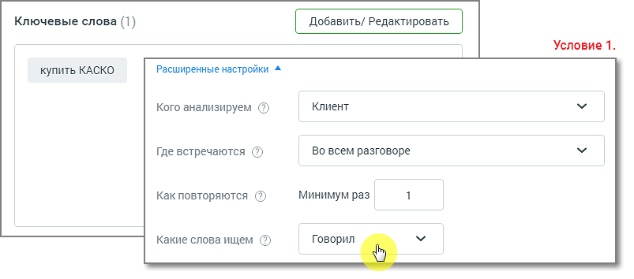
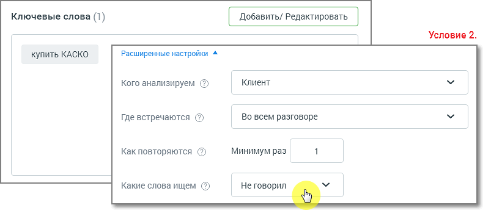
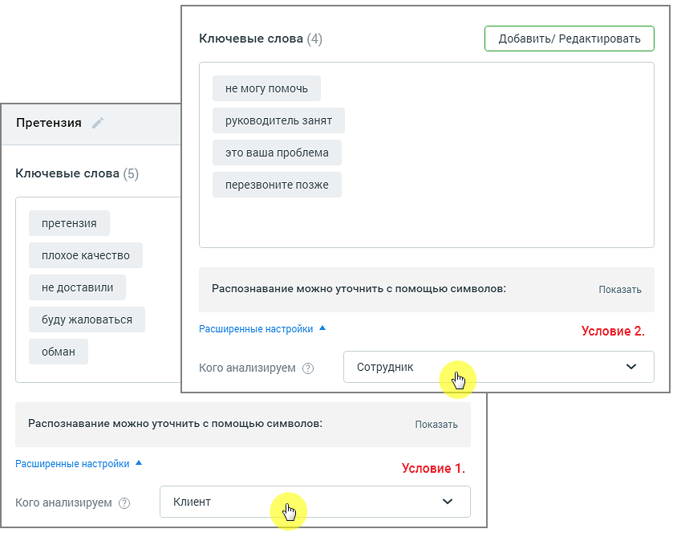

# 6.3. Советы по настройке тематик

> Трассировка: PDF §6.3 · сквозные стр. 49-52 · источники: ч.1 `kb/sources/speech-analytics/RECHEVAYA-ANALITIKA_1.26.18.pdf` с.49-52.

Создавайте простые тематики, чтобы одна тематика решала максимум одну задачу. Лучше создать несколько узконаправленных тематик, нежели одну общую. ПРИМЕР Известны основные конкуренты компании, их преимущества, отличия и т. д. Клиенты в разговоре с сотрудниками сравнивают продукты компании с продуктами конкурентов, и руководителю важно понимать, с какими конкурентами сравнивают. Знать параметры по каким компания выигрывает, по каким проигрывает. Таким образом можно запланировать изменения в продукте/ ценовой политике/ позиционировании на рынке и т. д. Решение: Создаем отдельные тематики для каждого из конкурентов с условиями Клиент, Говорил, Во всем разговоре и смотрим, как их упоминание меняется в динамике по времени. На основании полученных данных в работу компании вносятся изменения: меняется ценовая политика, корректируются позиционирование продукта, уникальное торговое предложение, скрипты продаж. Создавайте несколько тематик для решения одной задачи. По данным отчетов вы сможете увидеть, на каком этапе разговора у сотрудников возникают проблемы. Речевая аналитика | v.1.26.18 49

| 8 800 555 55 22, mango-office.ru |  |
| --- | --- |
|  | mango@mangotele.com |

При настройке тематик не задавайте противоречащие друг другу условия. Пример двух противоречащих Условий 1 и 2 в одной тематике:

Речевая аналитика | v.1.26.18 50

| 8 800 555 55 22, mango-office.ru |  |
| --- | --- |
|  | mango@mangotele.com |

Для заполнения поля “Какие слова ищем” ознакомьтесь с тем, как работает поиск по разговорам. Создавайте тематику из нескольких условий, только если это необходимо для решения конкретной задачи. Например, если в одном разговоре требуется проанализировать отдельно два канала – сотрудник и клиент – на соответствие разным условиям.

Речевая аналитика | v.1.26.18 51

| 8 800 555 55 22, mango-office.ru |  |
| --- | --- |
|  | mango@mangotele.com |
