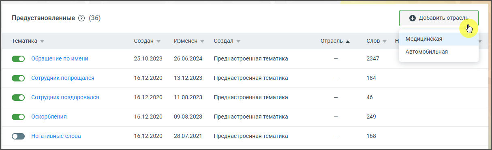

# 6.5. Предустановленные тематики

> Трассировка: PDF §6.5 · сквозные стр. 52-54 · источники: ч.1 `kb/sources/speech-analytics/RECHEVAYA-ANALITIKA_1.26.18.pdf` с.52-54.

По умолчанию в Речевой аналитике включены 36 предустановленных тематик: 1. Обращение по имени – кто говорил: сотрудник 2. Неуверенность оператора – кто говорил: сотрудник 3. Оператор просит прощения – кто говорил: сотрудник 4. Проблемная ситуация у клиента – кто говорил: клиент 5. Уменьшительно-ласкательные – кто говорил: сотрудник 6. Жалобы и недовольства клиента – кто говорил: клиент 7. Замечания про невнятную речь – кто говорил: сотрудник 8. Клиент делает замечания оператору – кто говорил: клиент 9. Клиент переживает – кто говорил: клиент Речевая аналитика | v.1.26.18 52

| 8 800 555 55 22, mango-office.ru |  |
| --- | --- |
|  | mango@mangotele.com |

10. Невыполненные обещания – кто говорил: клиент 11. Недовольные восклицания – кто говорил: клиент 12. Повторные обращения клиента – кто говорил: клиент 13. Сколько можно ждать – кто говорил: клиент 14. Требует начальника – кто говорил: клиент 15. Сотрудник уточнил стоимость – кто говорил: сотрудник 16. Клиент отказался от покупки – кто говорил: клиент 17. Слова паразиты – кто говорил: сотрудник 18. Сотрудник упомянул акцию – кто говорил: сотрудник 19. Чем занимается ваша компания – кто говорил: клиент 20. Ожидание – кто говорил: сотрудник 21. Допродажа – кто говорил: сотрудник 22. Проблемы со связью – кто говорил: клиент или сотрудник 23. Проблемы/Сложности с продуктом – кто говорил: клиент 24. Клиент не может разговаривать – кто говорил: клиент 25. Сотрудник динамит клиента – кто говорил: сотрудник 26. Сотрудник не может проконсультировать – кто говорил: сотрудник 27. Сотрудник закрывает сделку – кто говорил: сотрудник 28. Благодарность клиента – кто говорил: клиент 29. Сравнение с конкурентами – кто говорил: клиент 30. Клиент обратился за помощью – кто говорил: клиент 31. Матерные слова – кто говорил: клиент или сотрудник 32. Негативные слова – кто говорил: клиент или сотрудник 33. Оскорбления – кто говорил: клиент или сотрудник 34. Сотрудник поздоровался – кто говорил: сотрудник 35. Сотрудник попрощался – кто говорил: сотрудник 36. Некомпетентность оператора – кто говорил: сотрудник Предустановленные тематики можно редактировать и удалять. Подробнее см. в разделе Создание и редактирование тематик. Пользователи могут дополнять предустановленные тематики своими пользовательскими условиями. В Речевой аналитике имеется возможность тегировать разговоры сотрудников по предустановленным тематикам для различных отраслей, что избавляет от необходимости создавать тематики вручную. Тематики могут быть общими или отраслевыми (например, "Медицина" или "Автомобильная отрасль"). При подключении Речевой аналитики активируются только общие тематики. Нажатие на кнопку «Добавить отраслевые тематики» позволяет выбрать нужную отрасль и автоматически активировать соответствующие тематики. Добавленные тематики сразу начинают работать, обеспечивая мгновенное тегирование разговоров. Речевая аналитика | v.1.26.18 53

| 8 800 555 55 22, mango-office.ru |  |
| --- | --- |
|  | mango@mangotele.com |
