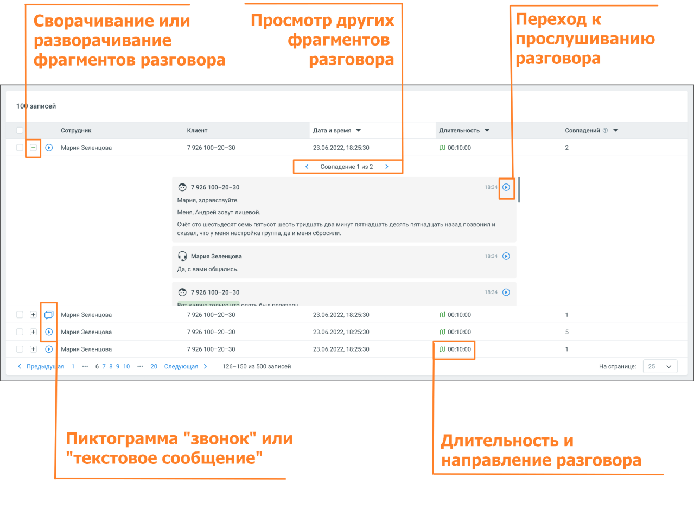

# 8.5.2. Блок результатов

> Трассировка: PDF §8.5.2 · сквозные стр. 100-102 · источники: ч.1 `kb/sources/speech-analytics/RECHEVAYA-ANALITIKA_1.26.18.pdf` с.100-102.

Блок содержит подробную информацию о срабатывание триггера, с отображением причины и результата срабатывания. Речевая аналитика | v.1.26.18 100

| 8 800 555 55 22, mango-office.ru |  |
| --- | --- |
|  | mango@mangotele.com |

Блок результатов содержит следующие данные: o Клиент и сотрудник, участники разговора o Источник записи o Длительность и направление разговора o Дата и время разговора o Количество совпадений с триггером в разговоре. Если в разговоре триггер сработал несколько раз, то для навигации по срабатываниям используйте пиктограммы влево <, и вправо > o Фрагменты разговора, в которых сработал триггер. В каждом фрагменте есть пиктограмма, которая открывает плеер или осциллограмму разговора: • с первой фразы причины триггера (для настроек отображения - Причина и Реакция) • с фразы, где имеется триггер (для настроек отображения - Реакция) Речевая аналитика | v.1.26.18 101

| 8 800 555 55 22, mango-office.ru |  |
| --- | --- |
|  | mango@mangotele.com |
