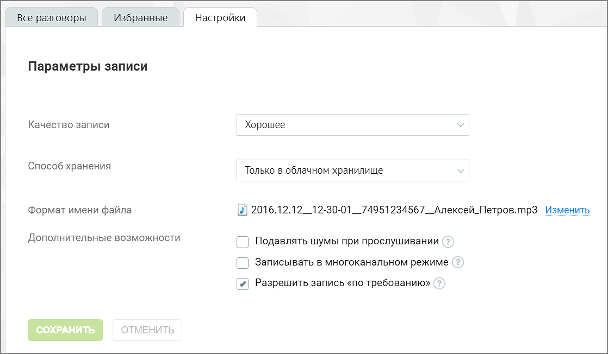

# 7.1.2. Настройки

> Трассировка: PDF §7.1.2 · сквозные стр. 64-65 · источники: ч.1 `kb/sources/speech-analytics/RECHEVAYA-ANALITIKA_VATS-_-Skoring-1.26.18.pdf` с.64-65.

В этой вкладке можно управлять параметрами осуществления, хранения и пересылки, а также изменить формат имени файла записи разговора.

Речевая аналитика. ВАТС & Офлайн скоринг | v.1.26.18 64

| 8 800 555 55 22, mango-office.ru |  |
| --- | --- |
|  | mango@mangotele.com |

Качество записи Качество записи влияет на размер файла. Предусмотрены следующие значения качества записи: • Высокое; • Хорошее; • Среднее; • Низкое. Способ хранения Пользователь может выбрать хранилища файлов из нескольких предложенных вариантов.
