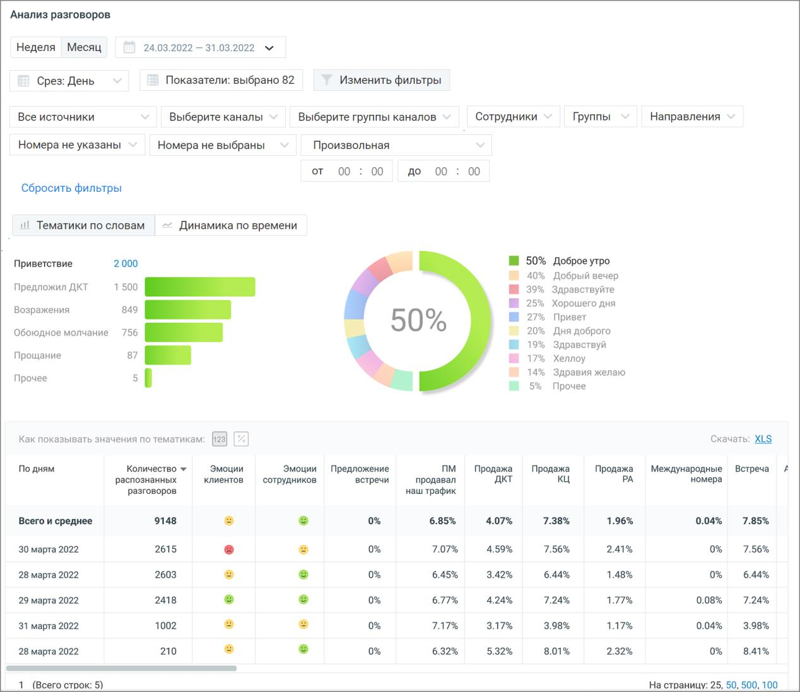
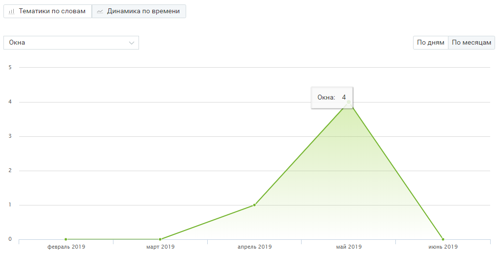

# 9.3.2. Блок визуализаций

> Трассировка: PDF §9.3.2 · сквозные стр. 90-92 · источники: ч.1 `kb/sources/speech-analytics/RECHEVAYA-ANALITIKA_VATS-_-Skoring-1.26.18.pdf` с.90-92.

Визуализация “Тематики по словам” В поле визуализации “Тематики по словам” отображается: Речевая аналитика. ВАТС & Офлайн скоринг | v.1.26.18 90

| 8 800 555 55 22, mango-office.ru |  |
| --- | --- |
|  | mango@mangotele.com |

Топ 5 выбранных тематик – наиболее популярные тематики (не более 5-ти) из тематик, выбранных пользователем во всплывающем окне “Показатели”, подраздел Количество разговоров по тематикам. Позволяет определить – какие из установленных тематик содержат наибольшее количество разговоров. Таким образом руководитель может видеть, к примеру, вектор заинтересованности клиентов в тех или иных товарах. Клик по любой из предложенных тематик позволяет увидеть подробную детализацию по этой тематике. Что говорят в тематике – для тематики, выбранной в “ТОП-5 популярных тематик”, показывает процентное соотношение распознанных терм по отношению к общему количеству терм тематики. В гистограмме отображается не более 10 строк. Если тематика содержит более 10 терм, наименее популярные из них помечаются, как Прочие.

Визуализация “Динамика по времени” Визуализация “Динамика по времени” представляет собой график изменений выбранного показателя в заданный период времени. Выпадающий список в левом верхнем углу графика содержит доступные для выбора показатели. При наведении курсора на элементы графика отображается всплывающая подсказка с информацией по соответствующему дню/месяцу. Речевая аналитика. ВАТС & Офлайн скоринг | v.1.26.18 91

| 8 800 555 55 22, mango-office.ru |  |
| --- | --- |
|  | mango@mangotele.com |

