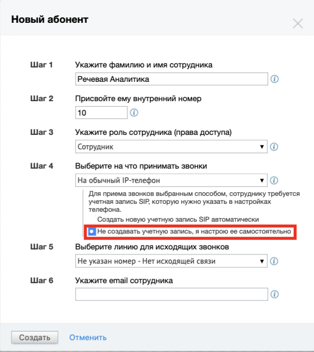

# 11.1.2. Создание сотрудника

> Трассировка: PDF §11.1.2 · сквозные стр. 124-125 · источники: ч.1 `kb/sources/speech-analytics/RECHEVAYA-ANALITIKA_VATS-_-Skoring-1.26.18.pdf` с.124-125.

Откройте личный кабинет по ссылке lk.mango-office.ru. На обзорной панели Личного кабинета ВАТС выберите блок Сотрудники и группы. Кликните по ссылке Добавить пользователя и заполните карточку сотрудника. Установите отметку на пункте «Не создавать SIP-запись, я настрою ее самостоятельно». Речевая аналитика. ВАТС & Офлайн скоринг | v.1.26.18 124

| 8 800 555 55 22, mango-office.ru |  |
| --- | --- |
|  | mango@mangotele.com |

Далее нужно добавить SIP-адрес для приема звонков. Так как пассивный SIP работает только на входящие звонки, необходимо на сторонней АТС создать свою SIP-линию. Лучше создавать пассивную линию, так как в основном даже при исходящих звонках от сотрудника будет осуществляться входящий звонок на стороннюю АТС. Так же можно создать SIP-аккаунт автоматически, и указать его на сторонней АТС как пассивную SIP-линию.
