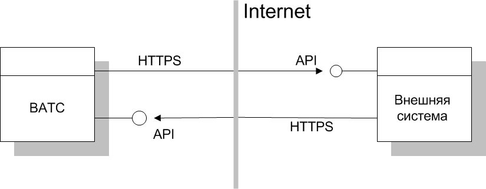

# 2.1.1. API ВАТС

> Трассировка: PDF §2.1.1 · сквозные стр. 11-12 · источники: ч.1 `kb/sources/vpbx-api/MangoOffice_VPBX_API_v1.9.pdf` с.11-12.

Описание модели Внешняя система и API ВАТС взаимодействуют по протоколу HTTPS. Для взаимодействия с некоторыми компонентами API ВАТС может потребоваться обмен IP-адресами. Такая модель будет работать только с такой внешней системой, которая может предоставить свой внешний (публичный) адрес для ее вызова со стороны API ВАТС. Типичным примером является B2B взаимодействие между двумя "облачными" сервисами.

Необходимые данные От API ВАТС для внешней системы предоставляются: 1) Базовый адрес API ВАТС в сети Интернет: https://app.mango-office.ru/vpbx/ (он же 81.88.85.67). Используется для формирования запросов к API ВАТС. 2) Уникальный код продукта ВАТС "vpbx_api_key" для идентификации системы, от имени которой отправлен запрос; 3) Уникальный ключ "vpbx_api_salt". Используется обеими сторонами для создания подписей сообщений. От внешней системы для API ВАТС предоставляется базовый адрес внешней системы в сети Интернет (IP или домен). Этот адрес будет использоваться для отправки запросов и уведомлений от ВАТС к внешней системе. При подключении API ВАТС в настройках Личного кабинета можно указать IP-адрес (или несколько IP-адресов), с которых могут приходить запросы от внешней системы к API, для повышения безопасности взаимодействия. Если при регистрации внешней системы указан IP-адрес(а), то все запросы с «неправильных» IP-адресов будут отвергаться. О запросах Запросы между системами условимся разделять на асинхронные и синхронные: - Асинхронные запросы, обращаясь к какому-либо сервису системы, ограничиваются только передачей данных, не требуя и не ожидая данные в ответ. Единственная информация, принимаемая в ответ — код состояния HTTP, т.е. код ответа, информирующий об успешности выполнения самого запроса; - Синхронные запросы: ожидающие какие-либо данные в теле ответа. Тело ответа должно представлять сплошную json-строку, если не оговорено иное, например mp3-файл или csv-файл. Параметры и данные, описывающие json-объект, специфичны и описаны для каждого сервиса отдельно. Авторизация Данные, которыми обмениваются системы, как правило, будут передаваться в теле POST- запроса. В этом случае в тело запроса включается обязательные параметры json, vpbx_api_key и sign. Подробнее о параметрах… Важно! Подписываются все запросы — как от внешней системы, так и от API ВАТС. Общее о кодах ответа сервера В случае успешного выполнения запроса, сервер возвращает HTTP-код 200 Ok и ответ в формате JSON. Иначе, если в результате выполнения запроса к API ВАТС, было выдано сообщение об ошибке, сервер возвращает: а) HTTP-код одного из следующих классов:

| Класс HTTP-кодов | Описание |
| --- | --- |
| 2xx | Передан неверный запрос к API ВАТС. Рекомендуем проверить корректность указания метода (эндпоинта) и параметров запроса. |
| 4xx | Переданы неверные параметры команды |
| 5xx | Объект не существует |

б) ответ в формате JSON, содержащий: - код ошибки API ВАТС; - описание ошибки (опционально). Возможные коды ошибок API ВАТС являются подмножеством кодов результатов (см. "Список кодов результатов"). Дополнительно В данном документе, во всех примерах запросов к API ВАТС в качестве базового адреса внешней системы будет использоваться условный URL https://external-system.com. Реальный базовый адрес внешней системы должен быть указан при подключении API, например: https://external-system.com/mango-api-connector/ Примеры запросов и отчетов в данном документе будут форматироваться с добавлением пробелов и переводов строк для лучшей читаемости.
