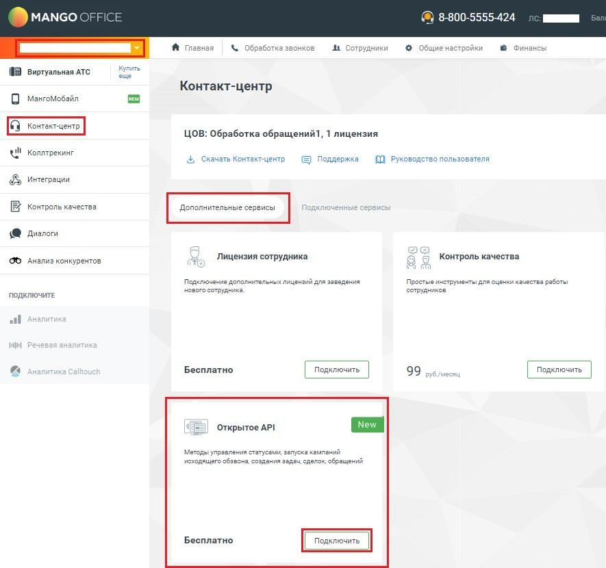
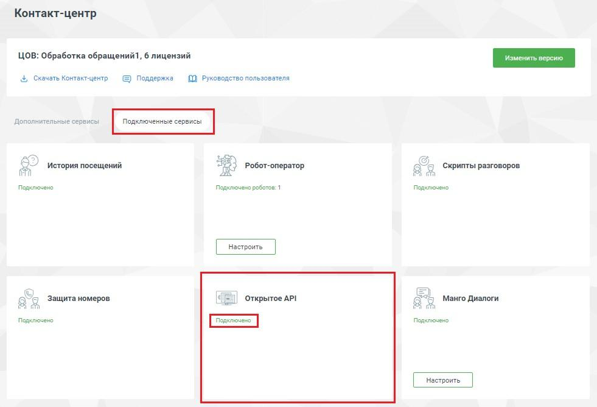
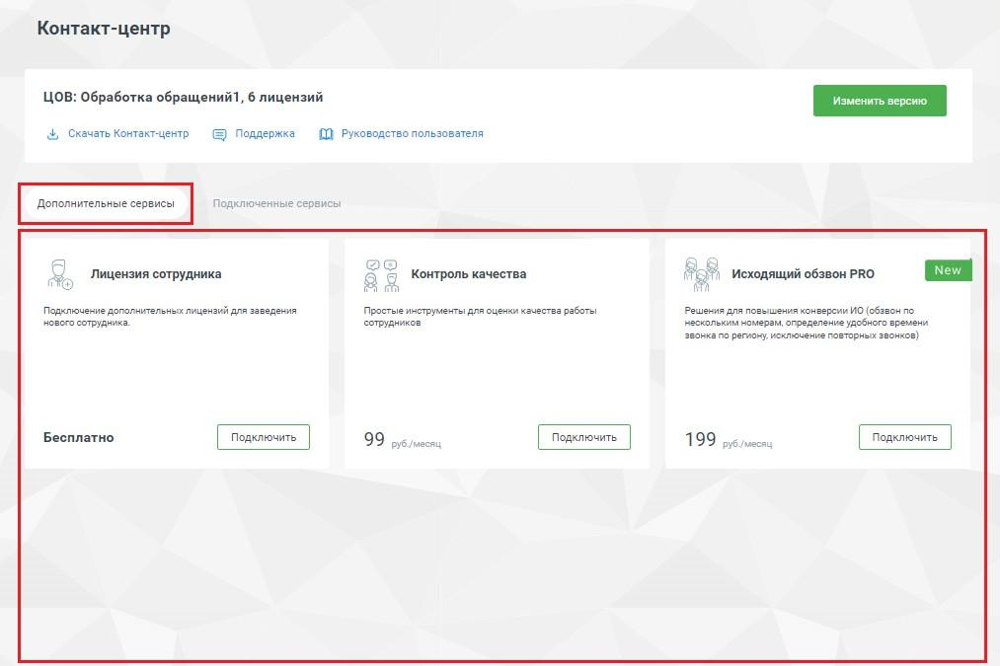

# 4.2. Подключение и настройка API КЦ

> Трассировка: PDF §4.2 · сквозные стр. 208-209 · источники: ч.1 `kb/sources/vpbx-api/MangoOffice_VPBX_API_v1.9.pdf` с.208-209.

Чтобы у вас появилась возможность работы с API КЦ, нужно подключить услугу "Открытое API" к вашей Виртуальной АТС MANGO OFFICE. Для этого, в Личном кабинете MANGO OFFICE следует: 1) выберите вашу ВАТС, если у вас их несколько; 2) нажмите на пункт "Контакт-центр"; 3) проверьте, что открыт раздел "Дополнительные сервисы"; 4) проверьте отображается ли в разделе "Дополнительные сервисы" блок "Открытое API": - если в этом разделе отображен блок "Открытое API", данная услуга НЕ подключена. В этом случае, нужно нажать на кнопку "Подключить" в блоке "Открытое API":

Рисунок 3 - если в разделе "Дополнительные сервисы" НЕ отображен блок "Открытое API":

Рисунок 4 то, данная УСЛУГА ПОДКЛЮЧЕНА. Чтобы еще раз удостовериться в том, что услуга "Открытое API" подключена, нажмите на кнопку "Подключенные сервисы" и проверьте, что в блоке "Открытое API" отображается надпись "Подключено":

Рисунок 5
