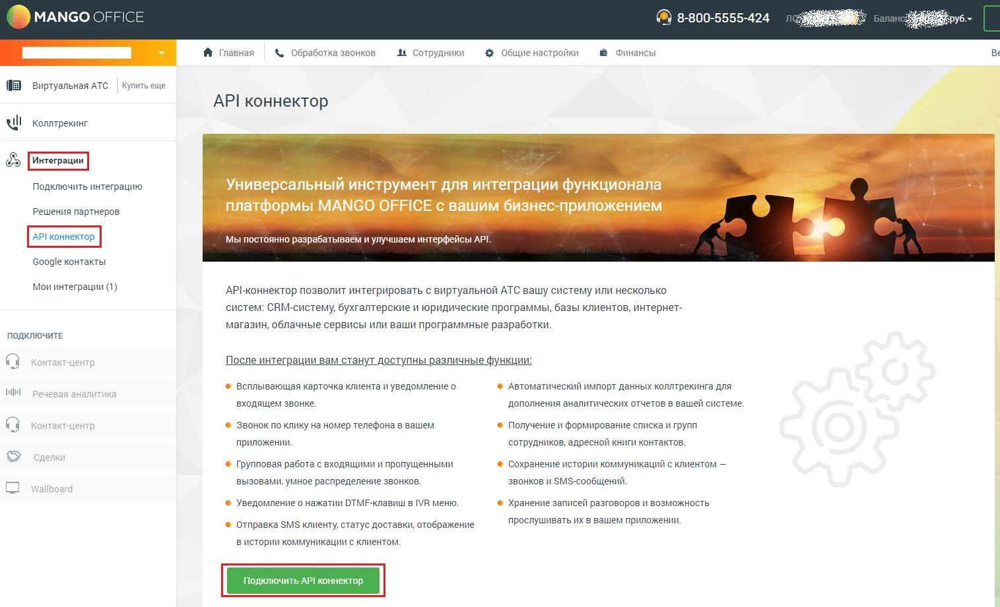

# 2.3. Работа с услугами Виртуальной АТС

> Трассировка: PDF §2.3 · сквозные стр. 13 · источники: ч.1 `kb/sources/vpbx-api/MangoOffice_VPBX_API_v1.9.pdf` с.13.

API предоставляет внешней системе доступ к подключению услуг. Для этого в личном кабинете выберите «Интеграции → API коннектор», в открывшемся разделе нажмите кнопку «Подключить API коннектор», чтобы активировать опцию:

Рисунок 1 В случае если этого не сделать, а в методе выполняются манипуляции с услугами, то возвращается код ответа: { "result":5201 }
