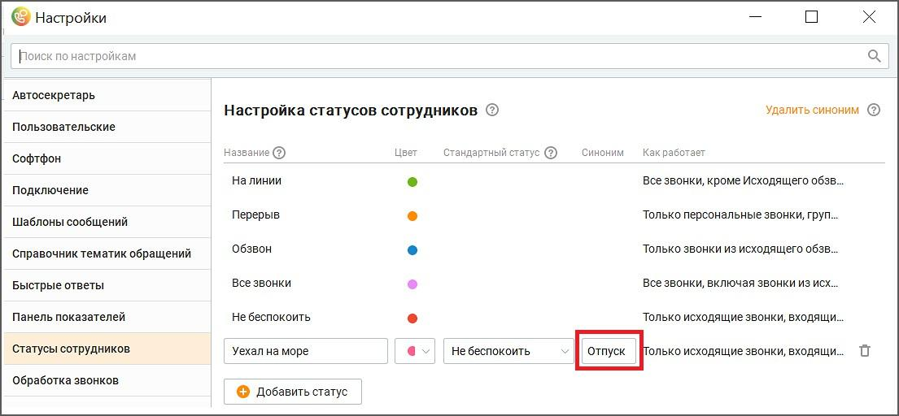

# 4.4.1.1. Что означает статус пользователя

> Трассировка: PDF §4.4.1.1 · сквозные стр. 223-224 · источники: ч.1 `kb/sources/vpbx-api/MangoOffice_VPBX_API_v1.9.pdf` с.223-224.

Статус - это атрибут пользователя, который определяет его готовность к приему вызовов. КЦ позволяет в любой момент времени выбрать нужный статус пользователя. Для выбора доступны: - предустановленные статусы - 6 статусов; - На линии; - Не беспокоить; - Перерыв; - Оффлайн; - Исходящий обзвон; - Все звонки. - пользовательский статус, созданный на основе предустановленных статусов. В КЦ можно создать до 30 пользовательских статусов, чтобы более гибко определять готовность оператора к приему вызовов. Обратите внимание, что вы можете работать через API только с теми пользовательскими статусами, которым в настройках КЦ присвоен синоним. В свою очередь, синоним соответствует параметру status_alias в методах API. Чтобы узнать, как присвоить синоним пользовательскому статусу, ознакомьтесь со справочными материалами КЦ.

Рисунок 6
