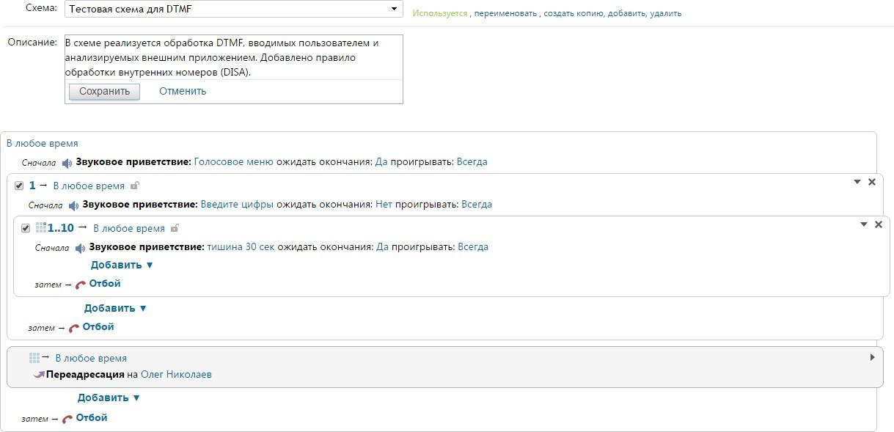

# Обработка нажатий DTMF-клавиш

> Трассировка: PDF §— · сквозные стр. 345-348 · источники: ч.1 `kb/sources/vpbx-api/MangoOffice_VPBX_API_v1.9.pdf` с.345-348.

Пример: Необходимо, чтобы при входящем звонке от абонента А, внешняя система обрабатывала звонок в зависимости от набора цифр, набранных абонентом А в голосовом меню, подпункте 1 меню IVR. Число цифр, набранные пользователем — от 1 цифры до 99 цифр. В зависимости от набранных цифр внешняя система принимает решение куда маршрутизировать звонок — на номер В или на номер C. Решение: В настройках схемы переадресации в пункте голосового меню 1: 1. Добавим сообщение, которое проинформирует абонента А о необходимости ввода цифр. Для этого воспользуемся стандартным голосовым сообщением "Введите цифры, используя клавиатуру телефона". 2. Добавим блок донабора внутреннего номера (DISA), в котором во время звонка Виртуальная АТС ожидает набора внутреннего номера с клавиатуры телефона. Воспользуемся возможностью настройки длины вводимого номера, чтобы абонент А мог ввести цифры произвольной длины. Укажем возможную длину донабора — от 1 до 99 цифр. В данном блоке после нажатия первой цифры дается 5 секунд на ввод номера. Примечание 1: В блоке донабора при нажатии абонентом А на "*" в телефоне — сбрасывается набранная абонентом последовательность цифр. Примечание 2: Если абонент ничего не введет, то дальнейшая обработка звонка будет выполнена согласно блоку "Отсутствие ввода". Если он не настроен, то звонок завершится. 3. Внешней системе необходимо обработать введенные цифры, принять решение о том, куда маршрутизировать звонок и выполнить маршрутизацию. Для этого в блок донабора добавим стандартное голосовое сообщение "Пожалуйста, подождите завершения обработки", с тишиной 10 секунд, при этом "ожидать окончание" = "да". Примечание. Длительность тишины необходимо подбирать согласно максимальной длительности обработки звонка внешней системой. Пример настройки схемы:

Во время звонка: 1. Поступает входящий звонок от абонента А, приходит событие о звонке, /events/call: { vpbx_api_key: "qwerty123", sign: "qwerty123", json: { entry_id: "4Nzg2ODQwMTo", call_id: "DAwOTU2NTo4MTozMTI2OTQyND", timestamp: 1488272633, seq: 1, call_state: "Appeared", location: "ivr", from: { number: "74955404444" }, to: { number: "74952150438", line_number: "74952150438" } } } 2. Абонент А слышит голосовое приветствие, нажимает 1 для перехода в пункт 1 меню IVR. Поступает событие о выборе пункта 1 в меню IVR, /events/dtmf: { vpbx_api_key: "qwerty123", sign: "qwerty123", json: { seq: 1, dtmf: "1", timestamp: 1488272649, call_id: "AwOTU2NTo4MTozMTI2OTQy", entry_id: "Nzg2ODQwMT", location: "ivr", initiator: "74955404444", from_number: "74955404444", to_number: "74952150438", line_number: "74952150438" } } 3. Абонент А слышит сообщение о необходимости ввода цифр. 4. Абонент А начинает вводить цифры. Через 5 секунд после ввода последней цифры ВАТС понимает об окончании ввода. 5. Поступает событие о набранных абонентом А цифрах в пункте 1 меню IVR, /events/dtmf { vpbx_api_key: "qwerty123", sign: "qwerty123", json: { seq: 2, dtmf: "123456789", timestamp: 1488272662, call_id: "AwOTU2NTo4MTozMTI2OTQy", entry_id: "Nzg2ODQwMT", location: "ivr.1", initiator: "74955404444", from_number: "74955404444", to_number: "74952150438", line_number: "74952150438" } } 6. Абоненту А проигрывается сообщение об ожидании завершения обработки. 7. Внешняя система принимает решение о маршрутизации звонка на номер С, выполняется /commands/route: { vpbx_api_key: "qwerty123", sign: "qwerty123", json: "{"command_id":"cid1488272666","call_id":"wOTU2NTo4MTozMTI2OTQ","to_number": "12"}" } Результат выполнения: { vpbx_api_key: "qwerty123", sign: "qwerty123", json: { command_id: "cid1488272666", result: 1000 } } 8. Начинается соединение абонента А с номером С, поступает событие /events/call { vpbx_api_key: "qwerty123", sign: "qwerty123", json: { entry_id: "zg2ODQw", call_id: "TU2NTo4MTozMTI2OT", timestamp: 1488272695, seq: 1, call_state: "Appeared", location: "abonent", from: { number: "74955404444", taken_from_call_id: "DAwOTU2NTo4MTozMTI2OTQyN" }, to: { extension: "12", number: "79260297870", line_number: "74952150438" } } }
