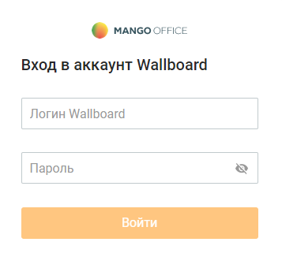

# 2. Страница авторизации

> Трассировка: PDF §2 · сквозные стр. 6-7 · источники: ч.1 `kb/sources/wallboard/Programma-dlya-EVM-Wallboard-Mango-Office_v7.22.25.pdf` с.6-7.

Доступ к модулю Программа для ЭВМ "Wallboard Mango Office" осуществляется по адресу https://tv.mango-office.ru/, введенному пользователем в адресной строке встроенного браузера TV либо в браузере компьютера.

Авторизуйте свой аккаунт и переходите к настройкам модуля. внимание Гостевые аккаунты могут использовать Wallboard только в режиме просмотра.
