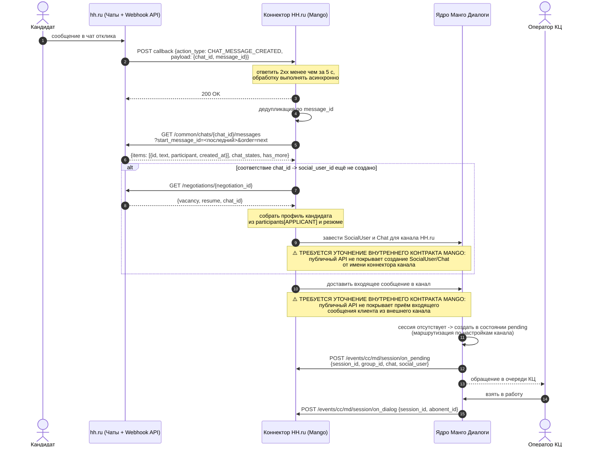
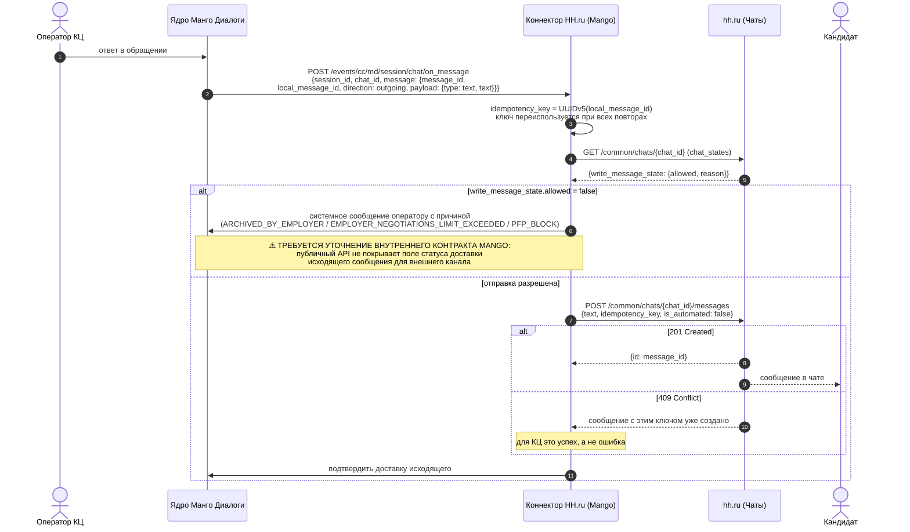
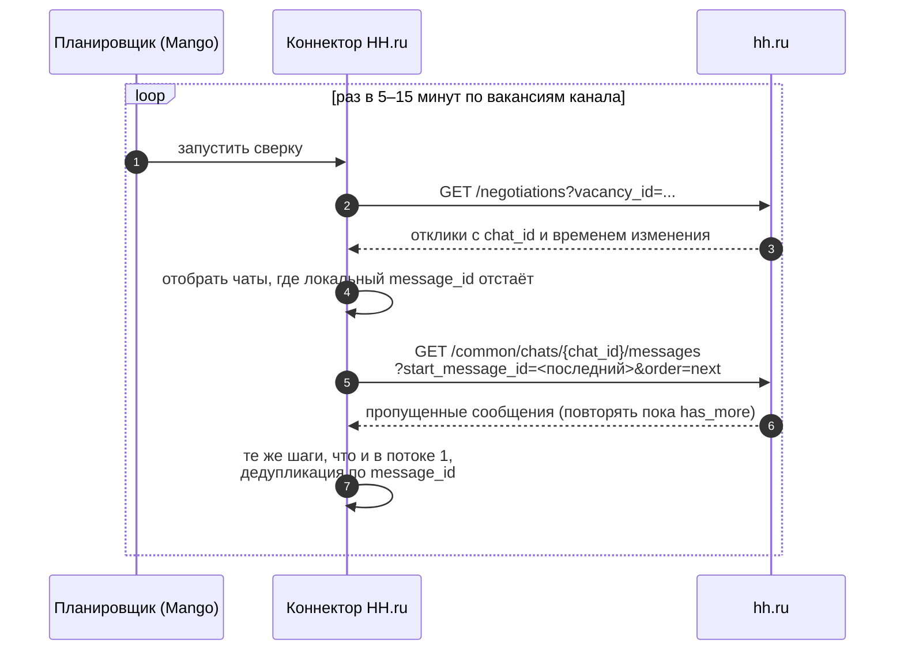

# Архитектурный спайк: маппинг данных HH.ru Чаты ↔ КЦ Mango (критический путь)

**Жанр документа.** Это *архитектурный спайк* — исследование, снижающее неопределённость перед решением, а не само решение. Обоснование жанра и структуры — в [`docs/analysis/2026-08-26-architecture-spike-format-research.md`](../../../../docs/analysis/2026-08-26-architecture-spike-format-research.md). Поэтому документ живёт в артефактах прогона, а не в `docs/adr/`: часть контракта Mango закрыта публичной документацией лишь частично, и текст обязан устареть в момент, когда внутренний контракт будет раскрыт.

**Адресат.** Архитектор и разработчики интеграции (Mango) — разделы 3–7; БА и Product Owner Mango — разделы 1, 2, 6, 8. Документ **внутренний**, Заказчику в этом виде не передаётся.

**Что нужно прочитать сначала.** [`RUN-0058/outputs/L2-gap-matrix.md`](../../RUN-0058/outputs/L2-gap-matrix.md) — покрытие ФТ-01…ФТ-10 и разрывы GAP-R1…GAP-R10; [`RUN-0058/outputs/L3-integration-architecture-notes.md`](../../RUN-0058/outputs/L3-integration-architecture-notes.md) — гипотезы Г1–Г5.

---

## 1. Контекст и рамки

Заказчик требует, чтобы переписка с кандидатами из чатов hh.ru обрабатывалась операторами **внутри КЦ Mango**, как обычный текстовый канал. RUN-0058 подтвердил, что публичный API hh.ru это позволяет со стороны hh.ru (14 операций раздела «Чаты», вебхуки `CHAT_CREATED` и `CHAT_MESSAGE_CREATED`), и зафиксировал один High Risk разрыв — GAP-R1 (чат виден только менеджерам-участникам).

Настоящий прогон отвечает на следующий вопрос: **как сообщение из чата hh.ru физически попадает в обращение КЦ Mango и обратно** — в терминах методов, полей и порядка вызовов.

Рамка сознательно узкая — только критический путь:

1. Получение сообщения кандидата из чата HH.ru.
2. Создание либо обновление обращения (сессии) в КЦ Mango.
3. Отправка ответа оператора обратно в чат HH.ru.

Вне рамок: вложения, HSM-шаблоны, перевод между операторами, закрытие сессии по таймауту, адресная книга, смена статуса отклика. Они упомянуты только там, где влияют на критический путь.

### 1.1. Circuit breaker: проверка источников выполнена

Постановка #331 запрещает выдумывать эндпоинты, методы и структуры JSON Mango и требует до анализа убедиться, что документация Mango есть в `kb/processed`.

**Проверка пройдена.** В репозитории присутствует `kb/processed/mdialogi-api/` — «Манго Диалоги. Справочник по API», версия 10.06.2026, 96 страниц, 70 разделов, confidence `high` ([`kb/processed/mdialogi-api/index.md`](../../../../kb/processed/mdialogi-api/index.md)). Дополнительно использованы `kb/processed/mango-lk-manual/` (настройка каналов, канал «Авито Работа») и `kb/processed/vpbx-api/`. Протокол проверки — [`../logs/source-availability.md`](../logs/source-availability.md).

Все ссылки на Mango в этом документе указывают на конкретный раздел `kb/processed/mdialogi-api/sections/`. Где публичная документация молчит, стоит маркер `⚠️ ТРЕБУЕТСЯ УТОЧНЕНИЕ ВНУТРЕННЕГО КОНТРАКТА MANGO`.

---

## 2. Что уже установлено по SSOT

### 2.1. Сторона HH.ru

Источник — действующая OpenAPI-спецификация `https://api.hh.ru/openapi/specification/public`, прочитанная в RUN-0058.

| Факт | Значение |
| --- | --- |
| Событие о сообщении | `CHAT_MESSAGE_CREATED`, доставляется только **активным участникам** чата |
| Payload события | `chat_id`, `message_id` — без текста, вакансии и резюме (GAP-R3) |
| Окно ответа на вебхук | 5 секунд, иначе повтор; допустимы `2xx` и `409` |
| Подпись вебхука | не документирована (`security: null`) |
| Чтение сообщений | `GET /common/chats/{chat_id}/messages`, пагинация `start_message_id` + `order: prev|next`, `limit` 1…50, `has_more` |
| Отправка | `POST /common/chats/{chat_id}/messages`, текст ≤ 20 000 символов, обязательный UUID `idempotency_key`, `201` либо `409` (дубль по ключу) |
| Право на отправку | `chat_states.write_message_state.allowed` + `reason`: `ARCHIVED_BY_EMPLOYER`, `EMPLOYER_NEGOTIATIONS_LIMIT_EXCEEDED`, `PFP_BLOCK` |
| Участники | роли `APPLICANT`, `EMPLOYER`, `BOT`; у соискателя есть `resume_id` |
| Адресация аккаунта | заголовок `X-Manager-Account-Id` |

### 2.2. Сторона Mango

Источник — `kb/processed/mdialogi-api`.

| Факт | Значение | Раздел |
| --- | --- | --- |
| BaseURL | `https://app.mango-office.ru/cc/md` | [`sections/12`](../../../../kb/processed/mdialogi-api/sections/12-model-vzaimodeystviya.md) |
| Авторизация | в каждом запросе `vpbx_api_key`, `json`, `sign`; `sign = sha256(vpbx_api_key + json + vpbx_api_salt)` | [`sections/11`](../../../../kb/processed/mdialogi-api/sections/11-model-avtorizacii.md), [`sections/17`](../../../../kb/processed/mdialogi-api/sections/17-ob-elektronnoy-podpisi-zaprosov.md) |
| Лимиты | 10 запросов/с на ВАТС, 100/с суммарно; для `chat/history` и `chat/send_message` — 4/с на ВАТС и 10/с суммарно; превышение → `429` | [`sections/15`](../../../../kb/processed/mdialogi-api/sections/15-limity-kolichestva-zaprosov-k-api.md) |
| Создание сессии | `POST /cc/md/session/create` | [`sections/35`](../../../../kb/processed/mdialogi-api/sections/35-sozdat-novuyu-sessiyu.md) |
| Отправка сообщения оператора | `POST /cc/md/session/chat/send_message`, текст ≤ 10 000 символов | [`sections/39`](../../../../kb/processed/mdialogi-api/sections/39-otpravit-soobschenie-operatora-k-klientu.md) |
| История чата | `POST /cc/md/session/chat/history` | [`sections/40`](../../../../kb/processed/mdialogi-api/sections/40-zagruzka-istorii-chata.md) |
| Вебхуки MD → внешняя система | `/events/cc/md/session/on_pending`, `on_dialog`, `on_close`, `/events/cc/md/session/chat/on_message` | [`sections/41`](../../../../kb/processed/mdialogi-api/sections/41-api-realtime-vebhuki.md), [`sections/49`](../../../../kb/processed/mdialogi-api/sections/49-novoe-soobschenie-v-chate.md) |
| Состояния сессии | `pending` → `dialog` → `closed` | [`sections/25`](../../../../kb/processed/mdialogi-api/sections/25-obekt-session.md) |
| Типы каналов | 2 сайт, 3 VK, 6 Telegram, 8 Email, 9 WhatsApp, 12 Avito, 13 клиентское приложение, 14 Авито Работа, 15 MAX | [`sections/22`](../../../../kb/processed/mdialogi-api/sections/22-obekt-shannel.md) |

### 2.3. Ключевое наблюдение, определяющее весь спайк

Публичный MDAPI описывает связку «**внешняя система ↔ Манго Диалоги**», где **коннектор канала принадлежит Mango**. В нём нет публичного метода «принять входящее сообщение клиента из внешнего канала»: единственный метод, создающий сессию, — `/cc/md/session/create` — по документации предназначен для сценария «оператор обращается к клиенту» и создаёт сессию сразу в состоянии `dialog` ([`sections/59`](../../../../kb/processed/mdialogi-api/sections/59-operator-obraschaetsya-k-klientu.md)); входящее обращение клиента в сценарии [`sections/58`](../../../../kb/processed/mdialogi-api/sections/58-priem-i-obrabotka-obrascheniy-klienta.md) возникает **внутри Mango** и наружу отдаётся вебхуком `on_pending`.

Второе наблюдение: в перечне типов каналов **HH.ru отсутствует**. Ближайший прецедент — «Авито Работа» (тип 14), подключаемый в ЛК по OAuth с правами «просмотр и отправка сообщений, данные о пользователях и вакансиях» ([`kb/processed/mango-lk-manual/sections/210-avito-rabota.md`](../../../../kb/processed/mango-lk-manual/sections/210-avito-rabota.md)).

Из этих двух фактов следует всё содержание раздела 6: интеграция HH.ru «сбоку», только на публичном API, архитектурно возможна лишь как обход, а целевое решение требует внутреннего контракта Mango.

---

## 3. Критический путь: диаграммы последовательности

Диаграммы отражают **рекомендуемый вариант A** (нативный канал HH.ru по аналогии с «Авито Работа»). Участник `Коннектор HH.ru` — компонент на стороне Mango; его интерфейс к ядру Диалогов публичным API не описан, что и помечено маркерами.

### 3.1. Поток 1 — входящее сообщение кандидата → обращение в КЦ



Если сессия по этому `chat_id` уже открыта (`state: dialog`), шаги создания пропускаются: сообщение добавляется в существующий чат, новое обращение не создаётся. Это прямо соответствует ФТ-05 и ФТ-07 (склейка сообщений в одно обращение).

### 3.2. Поток 2 — ответ оператора → сообщение в чат HH.ru



### 3.3. Поток 3 — сверка (закрывает недоставленные вебхуки, GAP-R4)



Сверка обязательна: доставка вебхуков hh.ru не гарантирована, а `get-common-chat-list` не имеет фильтра «изменённые с» и упирается в потолок ≈1000 чатов (GAP-R4).

---

## 4. Матрица маппинга данных

Направление отмечено в заголовке. Пустое поле «Поле Mango API» с маркером означает, что в публичном MDAPI приёмника нет.

### 4.1. Кандидат → `SocialUser`

| Сущность | Поле HH.ru API | Логика преобразования | Поле Mango API |
| --- | --- | --- | --- |
| Кандидат | `participants.applicants[].id` | Идентификатор соискателя используется как стабильный ключ клиента в рамках канала. Префикс канала обязателен, чтобы не столкнуться с id других каналов: `"hh:" + id` | `SocialUser.social_user_id` ([`sections/23`](../../../../kb/processed/mdialogi-api/sections/23-obekt-socialuser.md)) |
| Кандидат | `participants.applicants[].name` | Строка «Фамилия Имя Отчество» разбивается по пробелу: первый токен → фамилия, второй → имя. При невозможности разбора всё пишется в `nickname` | `SocialUser.last_name`, `SocialUser.first_name`, `SocialUser.nickname` |
| Кандидат | `sender_display_info.icon` | URL аватара передаётся как есть; при отсутствии поле не заполняется | `SocialUser.photo` |
| Кандидат | резюме: `contact[type=cell].value` | Нормализация в E.164. **Может отсутствовать**: в анонимных резюме контакты скрыты, просмотр расходует квоту (GAP-R7) | `SocialUser.phone` |
| Кандидат | резюме: `contact[type=email].value` | Как есть; те же ограничения GAP-R7 | `SocialUser.email` |
| Кандидат | `resume.alternate_url` | Ссылка на резюме — контекст для оператора | `SocialUser.profile_url` |
| Кандидат | `resume.title` (желаемая должность) | Как есть | `SocialUser.custom_fields` / `additional_fields` |
| Кандидат | — | Источник обращения фиксируется константой `"hh.ru"` | `SocialUser.referer` |

### 4.2. Чат и отклик → `Chat` / `Session`

| Сущность | Поле HH.ru API | Логика преобразования | Поле Mango API |
| --- | --- | --- | --- |
| Чат | `chat_id` | Хранить **строкой**: в откликах тип `number`, в чатах и вебхуках `string` (GAP-R9). Ключ соответствия `chat_id ↔ chat_id Mango` | `Chat.chat_id` ([`sections/24`](../../../../kb/processed/mdialogi-api/sections/24-obekt-shat.md)) |
| Чат | `participants.applicants[].id` | Тот же ключ клиента, что и в §4.1 | `Chat.client_id` |
| Обращение | факт первого входящего сообщения по неизвестному `chat_id` | Порождает новую сессию в состоянии `pending` с маршрутизацией по настройкам канала | `Session.session_id`, `Session.state` ([`sections/25`](../../../../kb/processed/mdialogi-api/sections/25-obekt-session.md)) |
| Обращение | `negotiation.vacancy.id` + `vacancy.name` | Контекст обращения; используется также для фильтра ФТ-04 по перечню вакансий канала | `Session.variables` |
| Обращение | `negotiation.resume.id` | Контекст обращения | `Session.variables` |
| Обращение | настройки канала: вакансия → группа/сотрудник | Маршрутизация ФТ-03. Соответствие ведётся в настройках канала, а не в API hh.ru | `Session.group_id` либо `Session.abonent_id` |
| Канал | — | ⚠️ **ТРЕБУЕТСЯ УТОЧНЕНИЕ ВНУТРЕННЕГО КОНТРАКТА MANGO: публичный API не покрывает поле `Channel.type` для HH.ru** — в перечне типов ([`sections/22`](../../../../kb/processed/mdialogi-api/sections/22-obekt-shannel.md)) есть 14 «Авито Работа», но нет HH.ru. Требуется завести новый тип канала | `Channel.type` |
| Канал | OAuth-токен работодателя hh.ru | Хранение и обновление токена на стороне коннектора | ⚠️ **ТРЕБУЕТСЯ УТОЧНЕНИЕ ВНУТРЕННЕГО КОНТРАКТА MANGO: публичный API не покрывает поля учётных данных внешнего канала** (в ЛК для «Авито Работа» это делается мастером подключения) |
| Канал | `X-Manager-Account-Id` интеграционного менеджера | Определяет, под каким менеджером работает интеграция; напрямую связан с GAP-R1 | ⚠️ **ТРЕБУЕТСЯ УТОЧНЕНИЕ ВНУТРЕННЕГО КОНТРАКТА MANGO: публичный API не покрывает поле «учётная запись внешней системы» в настройках канала** |

### 4.3. Сообщение кандидата → `Message` (входящее)

| Сущность | Поле HH.ru API | Логика преобразования | Поле Mango API |
| --- | --- | --- | --- |
| Сообщение | `items[].id` | Внешний идентификатор; ключ дедупликации при повторной доставке вебхука и при сверке | `Message.message_id` ([`sections/26`](../../../../kb/processed/mdialogi-api/sections/26-obekt-message.md)) |
| Сообщение | `items[].text` | Как есть. Ограничение источника 20 000 символов шире приёмника (10 000): длинное сообщение разбивается на части либо усекается — решение фиксируется НФТ | `Message.payload.text` при `payload.type = text` |
| Сообщение | `items[].created_at` | ISO 8601 → Unix timestamp | `Message.time` |
| Сообщение | `items[].participant.role = APPLICANT` | Роль отправителя определяет направление | `Message.direction = incoming` |
| Сообщение | `items[].type` | `SIMPLE` → обычное сообщение; `PARTICIPANT_JOINED` / `PARTICIPANT_LEFT` → служебное, в обращение не попадает либо попадает как `payload.type = info` | `Message.payload.type` |
| Сообщение | `participants.applicants[].id` | Ключ клиента | `Message.client_id` |
| Сообщение | — | Локальный идентификатор входящего в терминах Mango | `Message.local_message_id` |

### 4.4. Ответ оператора → сообщение hh.ru (исходящее)

| Сущность | Поле Mango API | Логика преобразования | Поле HH.ru API |
| --- | --- | --- | --- |
| Ответ | `message.payload.text` (вебхук `chat/on_message`, [`sections/49`](../../../../kb/processed/mdialogi-api/sections/49-novoe-soobschenie-v-chate.md)) | Как есть; предел приёмника 20 000 символов шире, усечение не требуется | `text` в теле `POST /common/chats/{chat_id}/messages` |
| Ответ | `message.local_message_id` | Детерминированный UUIDv5 от `local_message_id` — один ключ на сообщение, **переиспользуется при всех ретраях**, иначе кандидат получит дубль | `idempotency_key` |
| Ответ | `chat_id` (соответствие из §4.2) | Обратное разрешение в `chat_id` hh.ru | путь `{chat_id}` |
| Ответ | `message.direction = outgoing` | Проверка направления перед отправкой | — |
| Ответ | признак «отправлено роботом/автоответом» | Автоответы канала помечаются флагом | `is_automated` |
| Ответ | статус доставки | ⚠️ **ТРЕБУЕТСЯ УТОЧНЕНИЕ ВНУТРЕННЕГО КОНТРАКТА MANGO: публичный API не покрывает поле подтверждения доставки исходящего сообщения для внешнего канала** — вебхуки `on_delivered` / `on_read` ([`sections/47`](../../../../kb/processed/mdialogi-api/sections/47-soobschenie-operatora-dostavleno-klientu.md), [`sections/48`](../../../../kb/processed/mdialogi-api/sections/48-soobschenie-operatora-prochitano-kliento.md)) идут **из** Mango наружу, а не наоборот | `201` / `409` от hh.ru |

---

## 5. Примеры JSON

Примеры минимальны и содержат только поля, документированные в SSOT. Значения вымышлены, структуры — нет.

### 5.1. Вебхук hh.ru → коннектор: новое сообщение

```json
{
  "action_type": "CHAT_MESSAGE_CREATED",
  "payload": {
    "chat_id": "18374652",
    "message_id": "94021"
  }
}
```

Текста, вакансии и резюме в событии нет (GAP-R3) — далее обязателен запрос к API. Ответ коннектора: `200` за время менее 5 секунд, либо `409`, если сообщение уже обработано.

### 5.2. Чтение сообщений чата hh.ru

Запрос:

```http
GET /common/chats/18374652/messages?start_message_id=94020&order=next&limit=50
X-Manager-Account-Id: 5512340
```

Ответ (сокращён до полей критического пути):

```json
{
  "items": [
    {
      "id": "94021",
      "type": "SIMPLE",
      "text": "Здравствуйте! Готов приступить с понедельника, подскажите график.",
      "created_at": "2026-08-26T09:14:03+03:00",
      "participant": { "id": "31875402", "role": "APPLICANT" },
      "sender_display_info": { "name": "Иванов Иван", "role": "APPLICANT" }
    }
  ],
  "has_more": false,
  "chat_states": {
    "write_message_state": { "allowed": true, "reason": null },
    "send_file_state": { "allowed": true }
  }
}
```

### 5.3. Создание сессии в Mango

Публичный метод `/cc/md/session/create` ([`sections/35`](../../../../kb/processed/mdialogi-api/sections/35-sozdat-novuyu-sessiyu.md)) — единственный документированный способ породить сессию извне. Тело запроса (поле `json`):

```json
{
  "id": "hh-18374652-94021",
  "channel_id": "b3f1c0d2-8a44-4f0e-9c11-7d2e5a6b0011",
  "social_user_id": "hh:31875402",
  "abonent_id": "1041",
  "message": {
    "local_message_id": "hh-94021",
    "payload": {
      "type": "text",
      "text": "Здравствуйте! Готов приступить с понедельника, подскажите график."
    }
  }
}
```

Ответ:

```json
{
  "name": "OK",
  "status": 200,
  "code": 1000,
  "session_id": "0f8b1a7c-5d92-4c33-b0aa-9e4417cf2210",
  "message": {
    "local_message_id": "hh-94021",
    "message_id": "77120034",
    "time": 1787774043
  }
}
```

> ⚠️ **ТРЕБУЕТСЯ УТОЧНЕНИЕ ВНУТРЕННЕГО КОНТРАКТА MANGO: публичный API не покрывает поле `direction` при создании сессии.** Метод требует обязательный `abonent_id` (сотрудник) и создаёт сессию сразу в состоянии `dialog` от лица оператора — сообщение кандидата будет записано как исходящее и не встанет в очередь `pending`. Это делает метод пригодным только для обхода (вариант B, §6.2), но не для честного входящего обращения. Для варианта A нужен внутренний метод приёма входящего сообщения клиента из внешнего канала.

### 5.4. Вебхук Mango → коннектор: ответ оператора

Тело `/events/cc/md/session/chat/on_message` ([`sections/49`](../../../../kb/processed/mdialogi-api/sections/49-novoe-soobschenie-v-chate.md)):

```json
{
  "id": "d41d8cd98f00b204e980",
  "session_id": "0f8b1a7c-5d92-4c33-b0aa-9e4417cf2210",
  "chat_id": "c1a92f30-7b64-4d18-8f52-2ab6c9e04471",
  "message": {
    "message_id": "77120041",
    "local_message_id": "op-88231",
    "time": 1787774512,
    "direction": "outgoing",
    "client_id": "hh:31875402",
    "payload": {
      "type": "text",
      "text": "Добрый день! График 2/2, смены по 12 часов. Удобно созвониться завтра?"
    }
  }
}
```

### 5.5. Отправка ответа в чат hh.ru

```http
POST /common/chats/18374652/messages
X-Manager-Account-Id: 5512340
Content-Type: application/json
```

```json
{
  "text": "Добрый день! График 2/2, смены по 12 часов. Удобно созвониться завтра?",
  "idempotency_key": "3f2a9c14-6b7d-5e88-9a02-4c1b7e6d0099",
  "is_automated": false
}
```

Ответ `201`:

```json
{ "id": "94022" }
```

Ответ `409` означает, что сообщение с этим `idempotency_key` уже создано — для КЦ это успешное завершение, повтор отправки не требуется.

### 5.6. Превышение лимита на стороне Mango

```json
{
  "name": "Service Unavailable",
  "message": "Rate limit exceeded.",
  "code": 0,
  "status": 429
}
```

Лимиты `chat/send_message` и `chat/history` — 4 запроса/с на ВАТС и 10/с суммарно ([`sections/15`](../../../../kb/processed/mdialogi-api/sections/15-limity-kolichestva-zaprosov-k-api.md)); исходящий поток обязан идти через очередь с троттлингом.

---

## 6. Варианты решения

### 6.1. Вариант A — нативный канал HH.ru в Диалогах (по аналогии с «Авито Работа»)

Mango заводит новый тип канала; подключение выполняется в ЛК мастером с OAuth-авторизацией у hh.ru, как уже сделано для «Авито Работа» ([`sections/210` ЛК](../../../../kb/processed/mango-lk-manual/sections/210-avito-rabota.md)). Коннектор — внутренний компонент Mango, работающий с ядром Диалогов по внутреннему контракту.

- **За:** обращение попадает в очередь `pending` штатным путём; работают маршрутизация, автоответы, нерабочее время, автозакрытие; оператор не отличает канал HH.ru от прочих; ФТ-01…ФТ-03 закрываются настройками ЛК без доработок процесса.
- **Против:** требует разработки на стороне Mango и раскрытия внутреннего контракта (все маркеры ⚠️ в §3–§4 относятся именно сюда); зависит от роадмапа продукта.
- **Прецедент:** канал «Авито Работа» доказывает, что архитектурный шаблон «job-board как канал Диалогов» в продукте уже реализован.

### 6.2. Вариант B — внешний middleware как «клиентское приложение» (`Channel.type = 13`)

Middleware вне Mango принимает вебхуки hh.ru и работает с MDAPI публично: создаёт сессии `/cc/md/session/create`, отправляет сообщения `/cc/md/session/chat/send_message`, принимает вебхуки `on_message`.

- **За:** реализуемо целиком на опубликованном контракте; не требует изменений в ядре Диалогов; годится как пилот и как способ проверить бизнес-гипотезу.
- **Против:** `/cc/md/session/create` требует обязательный `abonent_id` и создаёт сессию сразу в `dialog` — обращение **минует очередь `pending`**, поэтому распределение по группе, автоответы и учёт нерабочего времени приходится воспроизводить в middleware; часть отчётности КЦ по каналу окажется некорректной; появляется третья система в эксплуатации.
- **Оценка:** приемлемо как временное решение, не приемлемо как целевое.

### 6.3. Вариант C — интеграция на стороне CRM Заказчика

hh.ru интегрируется с CRM, КЦ Mango не участвует.

- **Против:** прямо противоречит ФТ — операторы обязаны работать в КЦ Mango. Вариант зафиксирован для полноты и отклоняется.

### 6.4. Сравнение

| Критерий | A — нативный канал | B — middleware (тип 13) | C — на стороне CRM |
| --- | --- | --- | --- |
| Соответствие ФТ | полное | частичное | нет |
| Очередь `pending`, маршрутизация, автоответы | штатно | воспроизводится вручную | не применимо |
| Отчётность КЦ по каналу | корректна | искажена | отсутствует |
| Зависимость от внутреннего контракта Mango | высокая | отсутствует | отсутствует |
| Срок до первого результата | определяется роадмапом | короткий | не применимо |
| Пригодность как целевое решение | да | нет | нет |

---

## 7. Рекомендация и митигация GAP-R1

**Целевое решение — вариант A.** Вариант B допустим как пилот на ограниченном перечне вакансий, если требуется проверить спрос до включения канала в роадмап; при этом в пилоте нужно прямо зафиксировать, что метрики КЦ по каналу неполны.

Оба варианта упираются в один и тот же внешний ограничитель — **GAP-R1**: чат в hh.ru виден только менеджерам-участникам, доступа «на уровне работодателя» в API нет, а события доставляются только участникам.

### 7.1. Как GAP-R1 встроен в критический путь

| Шаг критического пути | Как проявляется GAP-R1 |
| --- | --- |
| Приём `CHAT_MESSAGE_CREATED` | Событие не придёт вовсе, если интеграционный менеджер не участник чата |
| `GET /common/chats/{chat_id}/messages` | `404` «чат не найден или не доступен текущему пользователю» |
| `POST /common/chats/{chat_id}/messages` | Отправка невозможна без доступа к чату |

То есть без митигации КЦ получит переписку только по вакансиям одного менеджера — цели ФТ («обработка силами общей группы рекрутеров») это не достигает.

### 7.2. Митигация, закладываемая в архитектуру

Многоуровневая, деградирующая от автоматической к организационной:

1. **Уровень 1 (организационный, подтверждён документацией) — M1.** Интеграционный менеджер назначается ответственным за все вакансии из перечня канала. Чаты создаются сразу у него, обходы не нужны. Это единственный вариант, работоспособность которого следует из самих правил hh.ru. Настройка канала обязана содержать явный перечень вакансий (не более 100 идентификаторов на запрос, GAP-R5) и явное указание интеграционного менеджера.
2. **Уровень 2 (автоматический, гипотеза Г1) — M2.** Подписка на `NEW_RESPONSE_OR_INVITATION_VACANCY` с `vacancies_only_mine: false` даёт `chat_id` по всем доступным вакансиям; коннектор немедленно вызывает `PUT /common/chats/{chat_id}/participants` и становится участником, после чего получает `CHAT_MESSAGE_CREATED`. **Не подтверждено спецификацией** — возможен `403`/`404`. Цена при успехе: в ленте чата появляется видимое кандидату системное сообщение `PARTICIPANT_JOINED`.
3. **Уровень 3 (устойчивость) — сверка из §3.3** закрывает как негарантированную доставку вебхуков, так и чаты, доступ к которым появился задним числом.
4. **Уровень 4 (внешний) — запрос к hh.ru** на доступ к чатам на уровне работодателя. Снимает ограничение полностью, срок не контролируется.

**Порядок действий:** проектировать на M1, реализовывать точку расширения под M2, проверить Г1 на боевом доступе работодателя до фиксации объёма работ. Строить решение только на M2 до проверки нельзя.

### 7.3. Единая точка отказа

Интеграция живёт под одним `X-Manager-Account-Id`. Блокировка менеджера или отзыв доступа приложению удаляет подписки на вебхуки и обрывает канал «тихо». В архитектуру закладываются: мониторинг доставки событий, алерт на постановку подписки в очередь на блокировку, процедура смены интеграционного менеджера с пересозданием подписок и повторным включением в чаты.

---

## 8. Последствия и открытые вопросы

### 8.1. Что следует из рекомендации

- Продуктовое: HH.ru становится новым типом канала Диалогов — это позиция роадмапа, а не задача интеграции «сбоку».
- Техническое: нужен внутренний контракт приёма входящего сообщения внешнего канала; без него честная очередь `pending` недостижима.
- Операционное: перечень вакансий канала и назначение ответственного менеджера в hh.ru становятся частью регламента Заказчика, а не только настройкой.
- Ограничение объёма поля: текст в Mango ≤ 10 000 символов против 20 000 в hh.ru — правило обработки длинных входящих должно быть зафиксировано НФТ.

### 8.2. Вопросы к внутренней команде Mango (блокирующие вариант A)

1. Существует ли внутренний метод приёма входящего сообщения клиента из коннектора внешнего канала, порождающий сессию в состоянии `pending`?
2. Как коннектор «Авито Работа» (тип 14) заводит `SocialUser` и `Chat` — тем же механизмом или иным?
3. Как заводится новый `Channel.type` и что требуется для добавления HH.ru?
4. Где хранятся и как обновляются OAuth-учётные данные внешнего канала?
5. Каким контрактом коннектор возвращает статус доставки исходящего сообщения?
6. Применяются ли лимиты из [`sections/15`](../../../../kb/processed/mdialogi-api/sections/15-limity-kolichestva-zaprosov-k-api.md) к внутреннему контуру или только к публичному API?

### 8.3. Что этот спайк не проверял

- Гипотезы Г1–Г5 из [`RUN-0058/outputs/L3`](../../RUN-0058/outputs/L3-integration-architecture-notes.md): доступа работодателя к hh.ru у исполнителя нет.
- Вложения, HSM, перевод и закрытие сессии, адресная книга, смена статуса отклика — вне рамок критического пути.
- Трудоёмкость разработки: без ответов §8.2 объём работ по варианту A не определён.
