# L4 — Комбинированный gap-отчёт со сносками для human review

Интеграция «Манго Диалоги» (Mango Office) ↔ чаты hh.ru. Отчёт объединяет
результаты двух прогонов и переводит их в форму, пригодную для построчной
проверки человеком:

- [`RUN-0058/outputs/L2-gap-matrix.md`](../../RUN-0058/outputs/L2-gap-matrix.md) — gap-матрица уровня БА;
- [`RUN-0059/outputs/architecture-spike.md`](../../RUN-0059/outputs/architecture-spike.md) — архитектурный спайк и маппинг данных.

## Что такое уровень L4

L4 наследует структуру L2 (сводка → разбор по ФТ → сводка разрывов → риски →
вопросы) и добавляет к каждому требованию ФТ-01…ФТ-10 три обязательных
подраздела:

| Подраздел | Содержание | Кто читает |
| --- | --- | --- |
| **БА** | Цитата верхнеуровневого требования и каждого подпункта §4.x.x, вердикт на уровне ФТ и на уровне подпункта, вывод L2 в проверенном виде. Каждый параметр или группа параметров помечены сноской. | БА, Заказчик |
| **СА** | Системно-аналитическая модель: JSON запроса/ответа к API hh.ru и диаграмма деятельности (activity), подтверждающие или опровергающие вывод подраздела «БА». | СА, архитектор |
| **Источники** | Расшифровка сносок: раздел документации, метод, прямая ссылка на операцию в Redoc hh.ru. | Рецензент-человек |

Нотация диаграмм: **UML Activity** (диаграмма деятельности) с дорожками
участников, отрисованная средствами Mermaid `flowchart`. Диаграммы
последовательности (sequence) в отчёте намеренно не применяются: постановка
требует модель взаимодействия систем и акторов **без детализации порядка
обмена сообщениями**.

Схема ссылок в подразделах «Источники»:
`https://api.hh.ru/openapi/redoc#tag/<slug(раздел)>/operation/<operationId>` —
переход раскрывает конкретный метод в документации hh.ru, рецензенту не нужно
искать его вручную. Полный машинно-порождённый указатель:
[`hh-api-source-index.md`](hh-api-source-index.md), генератор —
[`experiments/issue_333_hh_api_source_index.py`](../../../../experiments/issue_333_hh_api_source_index.py).

## Источник фактов и его версия

Все утверждения об API взяты из действующей OpenAPI-спецификации hh.ru:

| Параметр | Значение |
| --- | --- |
| URL | <https://api.hh.ru/openapi/specification/public> |
| Версия OpenAPI | `3.0.3` |
| Формат отдачи | `application/x-yaml` (JSON не отдаётся даже при `Accept: application/json`) |
| SHA-256 | `8ea1380bf87d7351cf2f977f9918bbdd03a26a6b9c9e95eb50f3d4ae080a7576` |
| Размер | 1 266 778 байт |
| Дата загрузки | 2026-08-27 |
| Операций всего | 131 в 47 разделах |

Спецификация **изменилась** с момента RUN-0058 (там зафиксирован SHA-256
`4349900b…6383d`). Поэтому все выводы L2 перепроверены заново по свежей
загрузке; протокол сверки и список расхождений —
[`../logs/l2-validity-recheck.md`](../logs/l2-validity-recheck.md), сводка
правок — [раздел 15](#15-что-исправлено-относительно-l2-run-0058).

Легенда вердиктов (наследуется из L2): **Да** — закрывается документированными
возможностями; **Частично** — закрывается с ограничениями или не полностью;
**Нет** — документированных средств не найдено.

## 0. Сводка

| ФТ | Требование (кратко) | L2 (RUN-0058) | L4 (RUN-0060) | Разрывы | Изменение |
| --- | --- | --- | --- | --- | --- |
| ФТ-01 | OAuth-авторизация в HeadHunter из ЛК | Да | Да | — | вывод подтверждён |
| ФТ-02 | Подключение и настройка канала HH в ЛК | Да | Да | — | вывод подтверждён |
| ФТ-03 | Маршрутизация обращений на сотрудника/группу | Да | Да | — | вывод подтверждён |
| ФТ-04 | Фильтрация входящих по вакансии (линейный персонал) | Частично | Частично | GAP-R5, GAP-R3 | вывод подтверждён, атрибуция полей исправлена |
| ФТ-05 | Создание обращения по первому входящему + контекст | Да | Частично | GAP-R1, **GAP-R11** | **вердикт понижен** |
| ФТ-06 | Двусторонняя синхронизация в реальном времени | Частично | Частично | GAP-R1, R3, R4, R6, R8 | вывод подтверждён |
| ФТ-07 | Склейка сообщений нескольких Акторов | Частично | Частично | GAP-R1, GAP-R2 | вывод подтверждён |
| ФТ-08 | Передача контекста (вакансия, резюме, кандидат) | Частично | Частично | GAP-R7, GAP-R9 | вывод подтверждён |
| ФТ-09 | Автосопоставление кандидата с Адресной книгой | Частично | Частично | GAP-R7 | вывод подтверждён |
| ФТ-10 | Отчёты и выгрузка по каналу HH | Да | Да | — | вывод подтверждён, состав полей уточнён |

Итог L4: **4 требования из 10 закрываются полностью, 6 — частично**;
требований без документированных средств нет. Отличие от L2 — одно:
вердикт ФТ-05 понижен с «Да» до «Частично» (см. [раздел 6](#6-фт-05--создание-обращения-и-контекст-сессии),
разрыв GAP-R11).

## 1. Опорный состав операций

Раздел «Чаты» содержит 14 операций; все они перепроверены в свежей
спецификации и присутствуют. Полный список с прямыми ссылками —
[`hh-api-source-index.md`](hh-api-source-index.md) (68 операций из 14 разделов,
задействованных в ФТ-01…ФТ-10).

Проверка трёх точек входа, заявленных постановкой [#329](https://github.com/G-Ivan-A/mango_ba_prompts/issues/329),
подтверждена повторно: `get-negotiation-item` возвращает `chat_id`,
`get-common-chat-list` отдаёт список чатов, событие `CHAT_MESSAGE_CREATED`
описано в разделе Webhook API. Условие постановки «если методов нет или они
описаны иначе — остановиться» не наступило.

## 2. ФТ-01 — Авторизация во Внешней системе

### 2.1. БА

> **ФТ-01.** Система должна предоставлять возможность Пользователю с правами
> администрирования авторизоваться во Внешней системе (HeadHunter) в процессе
> настройки интеграции для получения доступа к API чатов Кандидатов.

| Подпункт | Цитата | Вердикт | Основание |
| --- | --- | --- | --- |
| §4.1.1 | «Авторизация в HeadHunter реализуется через ЛК с использованием OAuth-протокола.» | **Да** | `POST /token` принимает `grant_type=authorization_code` с `client_id`, `client_secret`, `redirect_uri`, `code` `^1` и возвращает `access_token`, `token_type: bearer`, `expires_in` (в примере 1 209 600 с ≈ 14 суток), `refresh_token` `^1`. Отзыв — `DELETE /token` `^2`. |

**Вывод L2 (раздел 2) проверен и подтверждён без изменений:** переоценка API
чатов вердикт ФТ-01 не затрагивает; ограничений спецификация не вносит.

**Уточнение L2 подтверждено дословно.** У работодателя несколько менеджерских
аккаунтов: `GET /manager_accounts/mine` возвращает `items[]`,
`current_account_id`, `primary_account_id`, `is_primary_account_blocked` `^3`,
а описание метода прямо предписывает: «Для работы под определенным аккаунтом
необходимо передать значение account_id, полученное из списка, в заголовке:
`X-Manager-Account-Id: {account_id}`» `^3`. Настройка канала обязана явно
фиксировать, под каким менеджером работает интеграция, — это тот же аккаунт,
который упирается в GAP-R1 ([раздел 12](#12-gap-r1--сквозное-ограничение-видимости-чатов)).

**Вердикт ФТ-01: Да.**

### 2.2. СА

Модель: диаграмма деятельности с дорожками (UML Activity, swimlanes).
Проверяемое утверждение — «интеграция получает и удерживает работодательский
токен, привязанный к конкретному менеджерскому аккаунту».

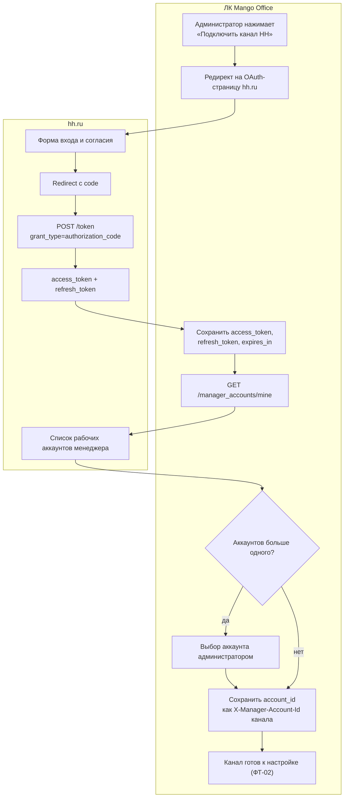

Запрос токена (`application/x-www-form-urlencoded`, пример из спецификации `^1`):

```http
POST https://api.hh.ru/token
Content-Type: application/x-www-form-urlencoded

grant_type=authorization_code&client_id=ETVQdMs2n9VKw7SMXkh9nX5H&client_secret=95dNjB8FmtxQsmygm6dtEy53&redirect_uri=http%3A%2F%2Fwww.example.com%2Foauth&code=29CtxMcaA8pRFDYyC8e8Gkm4
```

Ответ:

```json
{
  "access_token": "exampleAccessTokenRandomSymbols012345678900000000000000000000000",
  "token_type": "bearer",
  "expires_in": 1209600,
  "refresh_token": "exampleRefreshTokenRandomSymbols01234567890000000000000000000000"
}
```

Выбор рабочего аккаунта:

```json
{
  "items": [{"account_id": "12345678", "employer": {"id": "1455", "name": "Пример"}}],
  "current_account_id": "87654321",
  "primary_account_id": "12345678",
  "is_primary_account_blocked": false
}
```

**Вывод СА:** архитектура запроса подтверждает вывод «БА». Дополнительное
системное следствие, которого нет в ФТ: `expires_in` конечен, поэтому канал
обязан хранить `refresh_token` и обновлять доступ фоново — иначе канал
«молча» отвалится по истечении срока. Это же место — единая точка отказа
(см. [раздел 12.2](#122-единая-точка-отказа)).

### 2.3. Источники

| Сноска | Раздел документации | Метод | Ссылка для проверки |
| --- | --- | --- | --- |
| `^1` | Авторизация приложения / Авторизация работодателя | `POST /token` (`authorize`) | <https://api.hh.ru/openapi/redoc#tag/Avtorizaciya-prilozheniya/operation/authorize> |
| `^2` | Авторизация работодателя | `DELETE /token` (`invalidate-token`) | <https://api.hh.ru/openapi/redoc#tag/Avtorizaciya-rabotodatelya/operation/invalidate-token> |
| `^3` | Менеджеры работодателя | `GET /manager_accounts/mine` (`get-manager-accounts`) | <https://api.hh.ru/openapi/redoc#tag/Menedzhery-rabotodatelya/operation/get-manager-accounts> |

## 3. ФТ-02 — Подключение канала

### 3.1. БА

> **ФТ-02.** Система должна предоставлять возможность Пользователю с правами
> администрирования подключать и настраивать канал HeadHunter в ЛК после
> успешной авторизации во Внешней системе.

| Подпункт | Цитата | Вердикт | Основание |
| --- | --- | --- | --- |
| §4.2.1 | «Подключение: "ЛК → Текстовые коммуникации → Каналы → Группа каналов".» | **Да** | Сторона Mango Office; внешних ограничений нет. Паттерн канала «Авито Работа» (тип канала 14) уже реализован. |
| §4.2.2 | «Доступно включение и отключение канала.» | **Да** | Отключение на стороне hh.ru выражается удалением подписки: `DELETE /webhook/subscriptions/{subscription_id}` `^1`; список активных подписок — `GET /webhook/subscriptions` `^2`. |
| §4.2.3 | «Отключение канала прекращает прием новых сообщений из HeadHunter, но сохраняет доступ к историческим данным в интерфейсе КЦ.» | **Да** | Историю хранит КЦ; со стороны hh.ru после удаления подписки события не отправляются `^1`. |

**Вывод L2 (раздел 2) проверен и подтверждён без изменений.**

**Что L4 добавляет к L2.** Спецификация вводит существенное для §4.2.2
ограничение, не разобранное в L2: «В рамках одного приложения пользователь
может получать уведомления только на 1 url: нельзя подписаться разными
действиями на разные урлы» `^3`. Для канала это значит один приёмник вебхуков
на пару «менеджер + приложение», а маршрутизация по типам событий выполняется
уже внутри Mango. Второе: «При удалении приложения владельцем или отзыве
пользователем доступа у приложения все подписки на уведомления удаляются.
После восстановления доступа необходимо оформить новую подписку» `^3` —
отключение канала на стороне hh.ru может произойти **без участия Mango**, и
ФТ обязано описать восстановление.

**Вердикт ФТ-02: Да** (с требованием доопределить в ФТ реакцию на внешнее
удаление подписки).

### 3.2. СА

Модель: диаграмма деятельности жизненного цикла подписки (состояние канала как
следствие состояния подписки).

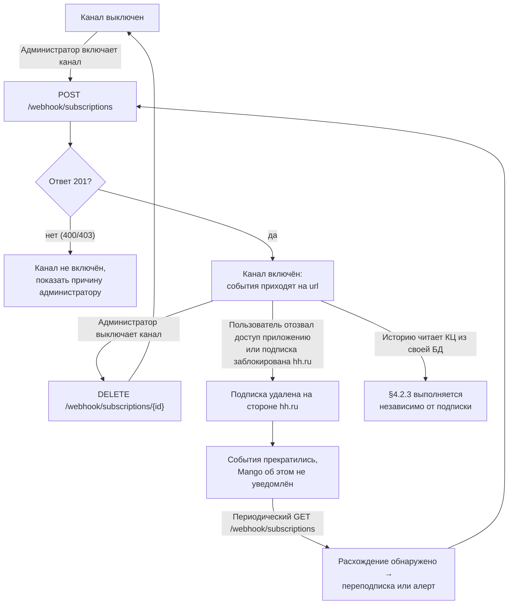

Запрос подписки `^3`:

```json
POST /webhook/subscriptions
{
  "url": "https://mango.example/hh/webhook?secret=<канальный секрет>",
  "actions": [
    {"type": "NEW_RESPONSE_OR_INVITATION_VACANCY", "settings": {"vacancies_only_mine": false}},
    {"type": "CHAT_MESSAGE_CREATED"},
    {"type": "CHAT_CREATED"}
  ]
}
```

Ответ — `201 Created` `^3`.

**Вывод СА:** «БА» подтверждается, но модель состояний вскрывает переход
`S5 → S7`, невидимый в текстовой формулировке ФТ: канал может оказаться
выключен извне. Отсюда системное требование — периодическая сверка
`GET /webhook/subscriptions` `^2` как watchdog канала.

### 3.3. Источники

| Сноска | Раздел документации | Метод | Ссылка для проверки |
| --- | --- | --- | --- |
| `^1` | Webhook API | `DELETE /webhook/subscriptions/{subscription_id}` (`cancel-webhook-subscription`) | <https://api.hh.ru/openapi/redoc#tag/Webhook-API/operation/cancel-webhook-subscription> |
| `^2` | Webhook API | `GET /webhook/subscriptions` (`get-webhook-subscriptions`) | <https://api.hh.ru/openapi/redoc#tag/Webhook-API/operation/get-webhook-subscriptions> |
| `^3` | Webhook API | `POST /webhook/subscriptions` (`post-webhook-subscription`) | <https://api.hh.ru/openapi/redoc#tag/Webhook-API/operation/post-webhook-subscription> |

## 4. ФТ-03 — Маршрутизация обращений

### 4.1. БА

> **ФТ-03.** Система должна предоставлять возможность Пользователю настраивать
> маршрутизацию созданных в КЦ Обращений из канала HeadHunter на Рекрутера или
> группу Рекрутеров единообразно (консистентно) с другими текстовыми каналами МД.

| Подпункт | Цитата | Вердикт | Основание |
| --- | --- | --- | --- |
| §4.3.1 | «Прием и обработка обращений (Кто будет принимать обращения, Распределение обращений)» | **Да** | Механика КЦ Mango; API hh.ru не участвует. |
| §4.3.2 | «Автоматические ответы» | **Да** (с оговоркой) | Автоответ уходит в hh.ru штатной отправкой `POST /common/chats/{chat_id}/messages` `^1`; в теле есть признак `is_automated` — «сообщение создано автоматически, например с помощью AI» `^1`. ФТ обязано определить, ставится ли он для автоответов канала. |
| §4.3.3 | «Общие настройки (Автоматическое завершение диалогов)» | **Да** | Механика КЦ; завершение диалога в КЦ не имеет обязательного отражения в hh.ru — смена статуса отклика выполняется отдельно (см. ФТ-06, GAP-R8). |

**Вывод L2 (раздел 2) проверен и подтверждён без изменений:** маршрутизация
выполняется в КЦ уже после создания Обращения и от ограничений API чатов не
зависит; это подтверждается и таблицей влияния GAP-R1 (строки «Skill-based
маршрутизация» и «Передача чата между операторами» — влияния нет,
[раздел 12.3](#123-влияние-gap-r1-на-сценарии-кц)).

**Вердикт ФТ-03: Да.**

### 4.2. СА

Модель: диаграмма деятельности с границей систем — показывает, что вся
маршрутизация лежит правее границы «hh.ru → Mango».

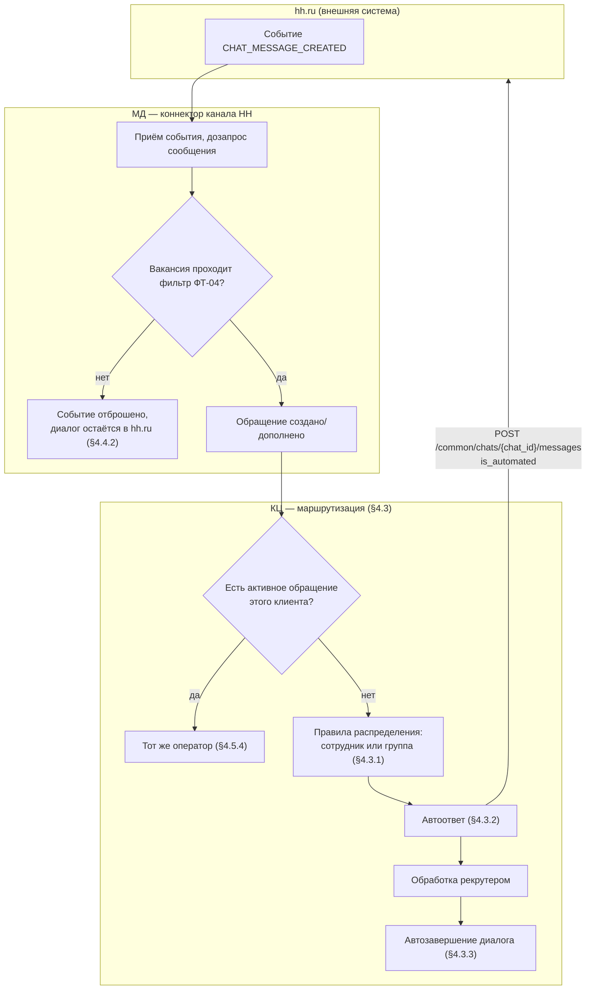

**Вывод СА:** подтверждает «БА». Единственная точка, где §4.3 касается API
hh.ru, — автоответ (§4.3.2): он материализуется как исходящее сообщение и
потому подчиняется тем же ограничениям, что и ответ оператора
(`write_message_state`, `idempotency_key` — см. ФТ-06).

### 4.3. Источники

| Сноска | Раздел документации | Метод | Ссылка для проверки |
| --- | --- | --- | --- |
| `^1` | Чаты | `POST /common/chats/{chat_id}/messages` (`chat-message-post`) | <https://api.hh.ru/openapi/redoc#tag/Chaty/operation/chat-message-post> |

## 5. ФТ-04 — Фильтрация по признаку вакансии

### 5.1. БА

> **ФТ-04.** Система должна предоставлять возможность Пользователю настраивать
> правила фильтрации входящих сообщений Кандидатов из канала HeadHunter в КЦ по
> признаку Вакансии для обеспечения коммуникации только по Вакансиям на линейный
> персонал.

| Подпункт | Цитата | Вердикт | Основание |
| --- | --- | --- | --- |
| §4.4.1 | «Система дает возможность передать в КЦ обработку коммуникаций только по вакансиям на линейный персонал.» | **Частично** | Отбор по **перечню** вакансий документирован: `filter_with_vacancy_ids` `^1` и `vacancy_status` (`all` / `with` / `without`) `^1`. Классификатора «линейный персонал» в API нет — GAP-R5. |
| §4.4.2 | «Сообщения по Вакансиям, не прошедшим фильтр (офисный персонал), не создают Обращений в КЦ. Диалог по таким Вакансиям ведется Рекрутером напрямую в HeadHunter.» | **Да** | Отбрасывание выполняется на стороне Mango; чат в hh.ru при этом не изменяется — интеграция не обязана в него вступать. |

**Проверка вывода L2 (раздел 3) — подтверждён по существу, атрибуция полей
исправлена.**

Подтверждено дословно:

- `filter_with_vacancy_ids` `^1` — «Строка разбирается в не более **100**
  целых id»; верхняя граница перечня в одном запросе сохраняется;
- `vacancy_status` `^1` с четырьмя документированными сценариями отбора;
- признака «линейный персонал» в спецификации нет — вывод RUN-0056 (GAP-4) и
  RUN-0058 (GAP-R5) остаётся в силе;
- `WebhookPayloadChatMessageCreated` содержит `chat_id`, `message_id`,
  `message_type`, `sender_participant_id`, `role`, `is_current_participant`,
  `creation_time` `^2` и **не содержит** `vacancy_id`, `resume_id` и текста —
  GAP-R3 подтверждён.

Исправлено (ошибка L2):

> L2 §3 утверждает: «Элемент списка чатов `ChatsCommonChatBasic` содержит
> `vacancy_id` (nullable)». Это **неверно**: `ChatsCommonChatBasic` `^1`
> содержит только `id`, `display`, `creation_time`, `unread_message_count`,
> `muted`, `block_reason`, `type`. Поля `vacancy_id` и `last_message`
> объявлены во **встроенной ветке `allOf` схемы `ChatsCommonChatItems`** `^1`,
> то есть присутствуют в ответе `get-common-chat-list`, но не в базовой схеме
> чата. Практический вывод L2 («по списку чатов вакансия доступна») сохраняется
> без изменений; исправляется только указание схемы, по которому рецензент
> проверяет факт.

Добавлено L4 (в L2 не разобрано): чат несёт поле `type` со значениями
`NEGOTIATION` / `SUPPORT` / `BOT` / `COMMON` `^1`, где `NEGOTIATION` —
«чат, который привязан к отклику/приглашению на вакансию». Канал КЦ должен
обрабатывать только `NEGOTIATION`: чаты `SUPPORT` и `BOT` к подбору персонала
не относятся, и ФТ этого различия не задаёт.

> ⚠️ **GAP-R5** (уровень: Medium; подтверждён): классификатора «линейный
> персонал» в API hh.ru нет. Автоматическая фильтрация по формулировке ФТ-04
> невыполнима — требуется явный перечень вакансий, выбираемый Пользователем в
> настройках канала, не более 100 идентификаторов на запрос `^1`.

> ⚠️ **GAP-R3** (уровень: Medium; подтверждён): payload события
> `CHAT_MESSAGE_CREATED` не содержит ни `vacancy_id`, ни `resume_id`, ни текста
> сообщения `^2`. Любое входящее сообщение требует минимум одного
> дополнительного запроса (`get-chat-messages` `^3`), а фильтрация по вакансии —
> заранее построенного соответствия `chat_id → vacancy_id`.

**Вердикт ФТ-04: Частично.** Фильтрация по перечню вакансий реализуема; по
категории «линейный персонал» — нет. Правка формулировки ФТ, предложенная в
RUN-0056 и подтверждённая в RUN-0058, остаётся в силе.

### 5.2. СА

Модель: диаграмма деятельности с явным хранилищем данных (activity + datastore).
Проверяемое утверждение — «фильтр по вакансии невозможно применить к событию
сообщения без заранее наполненного соответствия `chat_id → vacancy_id`».

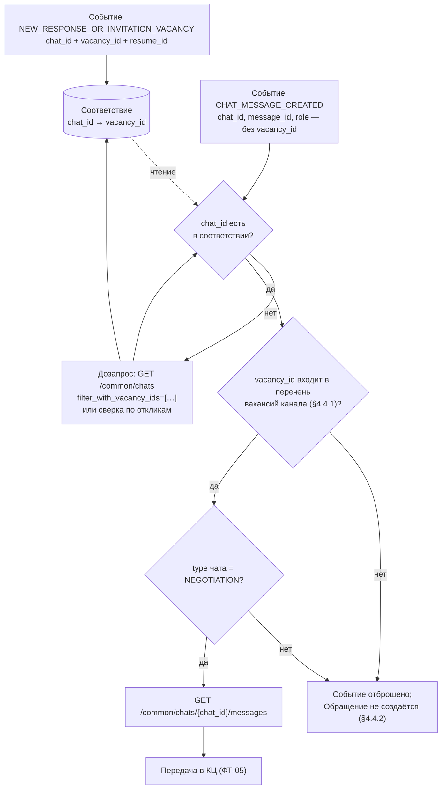

Отбор списка чатов по перечню вакансий `^1`:

```http
GET /common/chats?vacancy_status=all&filter_with_vacancy_ids=[113001,113002]&per_page=20&page=0
X-Manager-Account-Id: 12345678
```

Ответ (структура по `ChatsCommonChatItems` `^1`; `vacancy_id` и `last_message`
приходят из ветки `allOf`, а не из `ChatsCommonChatBasic`):

```json
{
  "items": [
    {
      "id": "10267",
      "type": "NEGOTIATION",
      "creation_time": "2026-08-27T10:15:00+0300",
      "unread_message_count": 2,
      "muted": false,
      "block_reason": null,
      "display": {"name": "Иванов Иван"},
      "vacancy_id": "113001",
      "last_message": {"id": "88231", "creation_time": "2026-08-27T10:16:40+0300"}
    }
  ]
}
```

Событие сообщения `^2` — для сравнения состава полей:

```json
{
  "id": "0f1c…",
  "subscription_id": "77123",
  "action_type": "CHAT_MESSAGE_CREATED",
  "user_id": "0",
  "payload": {
    "chat_id": "10267",
    "message_id": "88231",
    "message_type": "SIMPLE",
    "sender_participant_id": "5501",
    "role": "APPLICANT",
    "is_current_participant": false,
    "creation_time": "2026-08-27T10:16:40+0300"
  }
}
```

**Вывод СА:** оба JSON рядом делают GAP-R3 наглядным — в событии нет ни одного
поля, по которому фильтр ФТ-04 мог бы сработать. Модель подтверждает вывод
«БА» и добавляет к нему архитектурное следствие: соответствие
`chat_id → vacancy_id` — обязательный элемент решения, а не оптимизация, и
наполняться оно должно из события отклика (Путь 4, [раздел 13](#13-пути-получения-сообщений-и-выбор-для-кц)).

### 5.3. Источники

| Сноска | Раздел документации | Метод / схема | Ссылка для проверки |
| --- | --- | --- | --- |
| `^1` | Чаты | `GET /common/chats` (`get-common-chat-list`): параметры `page`, `per_page`, `filter_unread`, `filter_has_text_message`, `vacancy_status`, `filter_with_vacancy_ids`; схемы ответа `ChatsCommonChatItems`, `ChatsCommonChatBasic` | <https://api.hh.ru/openapi/redoc#tag/Chaty/operation/get-common-chat-list> |
| `^2` | Webhook API | Callback `onData`, схемы `WebhookSendObjectBaseUser`, `WebhookPayloadChatMessageCreated` (раздел Callbacks метода `post-webhook-subscription`) | <https://api.hh.ru/openapi/redoc#tag/Webhook-API/operation/post-webhook-subscription> |
| `^3` | Чаты | `GET /common/chats/{chat_id}/messages` (`get-chat-messages`) | <https://api.hh.ru/openapi/redoc#tag/Chaty/operation/get-chat-messages> |

## 6. ФТ-05 — Создание обращения и контекст сессии

### 6.1. БА

> **ФТ-05.** Система должна обеспечивать создание Обращения в Чате с клиентом
> КЦ в момент поступления первого входящего сообщения от Кандидата в канале
> HeadHunter по Вакансии, по которой отсутствует активное Обращение, и передачу
> в КЦ исторического контекста, накопленного в открытой Сессии по
> соответствующей Вакансии.

| Подпункт | Цитата (сокращённо) | Вердикт | Основание |
| --- | --- | --- | --- |
| §4.5.1 | «Создание Обращения происходит исключительно по факту отправки Кандидатом текстового сообщения в чат HeadHunter.» | **Частично** | Авторство определяется: `role: APPLICANT` в payload события `^1` и `sender_display_info.role` в сообщении `^2`. «Текстовость» по событию **не определяется**: `message_type: SIMPLE` документирован как «сообщение с текстом **либо вложениями**» `^1`, `^2`; нужен дозапрос и проверка `payload.text != null` `^2`. |
| §4.5.2 | «Отклики без текста не создают Обращений (является включаемой и отключаемой опцией, по умолчанию выключено).» | **Частично** | Отклик и сообщение — разные события (`NEW_RESPONSE_OR_INVITATION_VACANCY` / `NEW_NEGOTIATION_VACANCY` против `CHAT_MESSAGE_CREATED`) `^3`, поэтому опцию реализовать можно. Но фильтра «чат содержит текстовое сообщение» в API нет — см. исправление ниже, GAP-R11. |
| §4.5.3 | «Система сохраняет сессию … срок жизни сессии без входящего сообщения от клиента — не более 7 дней…» | **Да** | Механика КЦ Mango (паттерн «Авито Работа»); внешних ограничений нет. TTL со стороны hh.ru не документирован и не требуется. |
| §4.5.4 | «Обращения по разным Вакансиям от одного Кандидата формируют отдельные обращения в КЦ… распределять на оператора, который взял в работу первое поступившее обращение…» | **Да** | Модель hh.ru совпадает: чат типа `NEGOTIATION` привязан к отклику `^4`, а для пары «вакансия + резюме» существует один отклик. Ключ «Кандидат + Вакансия» ложится на модель без допущений. |
| §4.5.5 | «Новое сообщение по ранее закрытой Вакансии инициирует создание новой Сессии (п.4.5.3).» | **Да** | Со стороны hh.ru чат не закрывается и продолжает существовать; новое сообщение приходит тем же событием `^1`. Ограничение: если чат заблокирован, это видно в `block_reason` `^4` и `write_message_state` `^2`. |
| §4.5.6 | «Обработку обращения Рекрутер выполняет в соответствии с текущим функционалом Чата с клиентом КЦ.» | **Да** | Сторона Mango. |

**Проверка вывода L2 (раздел 4) — вердикт скорректирован с «Да» на
«Частично».**

Подтверждено дословно:

- разделение событий отклика и сообщения `^3`;
- тип сообщения различается полем `type` (`SIMPLE` / `PARTICIPANT_LEFT` /
  `PARTICIPANT_JOINED`) `^2`, поэтому системные записи об изменении состава
  участников не создадут ложных обращений;
- привязка чата к отклику `^4` и, как следствие, корректность ключа
  «Кандидат + Вакансия».

Исправлено (ошибка L2):

> L2 §4 утверждает, что список чатов принимает `filter_has_text_message`
> («только чаты, в которых есть хотя бы одно текстовое сообщение», доступен
> работодателю), и приводит этот параметр как один из трёх способов отличить
> «отклик без текста» от «сообщения кандидата». В спецификации параметр описан
> иначе: «**Фильтр по чатам с активными переписками. Доступно только для
> работодателя**» `^5`. Про наличие текста в описании ничего не сказано,
> «активная переписка» — не синоним «есть текстовое сообщение». Опираться на
> этот параметр при реализации §4.5.2 нельзя.
>
> Второе следствие: `SIMPLE` покрывает и текст, и вложения `^1`, `^2`, поэтому
> «текстовость» первого сообщения устанавливается только разбором ленты
> сообщений (`payload.text != null`), то есть дополнительным запросом.

> ⚠️ **GAP-R11** (уровень: Medium; новый в L4): признака «чат содержит
> текстовое сообщение» в API нет, а тип `SIMPLE` не отличает текст от вложения.
> Требования §4.5.1 («исключительно по факту отправки текстового сообщения») и
> §4.5.2 («отклики без текста не создают Обращений») реализуемы только через
> дозапрос `get-chat-messages` `^6` и проверку `payload.text != null` по каждому
> событию. Совместно с GAP-R3 это означает: **на каждое входящее событие —
> минимум один синхронный запрос к API hh.ru**, что и является источником
> нагрузки, для которой в ФТ (§5 НФТ пуст) нет ни одного ограничения.

**Вердикт ФТ-05: Частично** (в L2 — «Да»). Механика создания обращения
документирована полностью; частичность — из-за GAP-R11 (текстовость
определяется только дозапросом) и общего охвата потока (GAP-R1).

### 6.2. СА

Модель: диаграмма деятельности с условными узлами, соответствующими подпунктам
§4.5.1–§4.5.5 (каждое решение подписано номером подпункта — это делает модель
прямой проверкой «БА»).

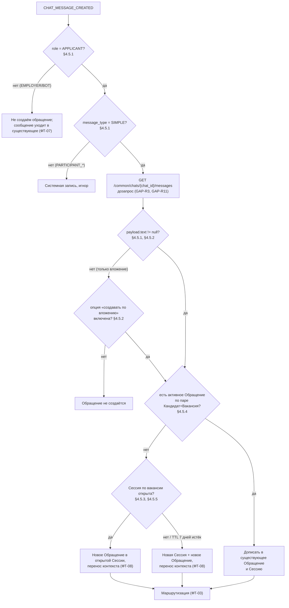

Дозапрос ленты сообщений `^6`:

```http
GET /common/chats/10267/messages?limit=50&order=prev
X-Manager-Account-Id: 12345678
```

Ответ (существенные поля схемы `ChatsCommonMessage` `^2`):

```json
{
  "has_more": false,
  "messages": [
    {
      "id": "88231",
      "type": "SIMPLE",
      "creation_time": "2026-08-27T10:16:40+0300",
      "last_change_time": null,
      "can_edit": false,
      "sender_participant_id": "5501",
      "sender_display_info": {"name": "Иванов Иван", "role": "APPLICANT", "icon": null},
      "viewed_by_opponent": false,
      "payload": {"text": "Здравствуйте, готов выйти на смену", "attachments": null, "moved_participant": null}
    }
  ]
}
```

Ключевая проверка: **`type: SIMPLE` есть и у сообщения-вложения**; отличить
текст можно только по `payload.text`, а `payload` описан как «Все поля
необязательны для заполнения, но одно из них обязательно должно быть в
payload» `^2`.

**Вывод СА:** модель опровергает вывод L2 «Да» и подтверждает вердикт L4
«Частично»: между событием и созданием Обращения обязателен синхронный
дозапрос, а условие §4.5.1 проверяется на его результате, а не на событии.

### 6.3. Источники

| Сноска | Раздел документации | Метод / схема | Ссылка для проверки |
| --- | --- | --- | --- |
| `^1` | Webhook API | Callback `onData` → `WebhookPayloadChatMessageCreated` (поля `role`, `message_type`) | <https://api.hh.ru/openapi/redoc#tag/Webhook-API/operation/post-webhook-subscription> |
| `^2` | Чаты | `GET /common/chats/{chat_id}/messages` (`get-chat-messages`), схемы `ChatsCommonMessage`, `ChatsCommonSenderDisplayInfo`, `chat_states.write_message_state` | <https://api.hh.ru/openapi/redoc#tag/Chaty/operation/get-chat-messages> |
| `^3` | Webhook API | `POST /webhook/subscriptions` (`post-webhook-subscription`), перечень `actions`: `NEW_NEGOTIATION_VACANCY`, `NEW_RESPONSE_OR_INVITATION_VACANCY`, `CHAT_CREATED`, `CHAT_MESSAGE_CREATED` | <https://api.hh.ru/openapi/redoc#tag/Webhook-API/operation/post-webhook-subscription> |
| `^4` | Чаты | `GET /common/chats` (`get-common-chat-list`), схема `ChatsCommonChatBasic`: поля `type` (`NEGOTIATION`…), `block_reason` | <https://api.hh.ru/openapi/redoc#tag/Chaty/operation/get-common-chat-list> |
| `^5` | Чаты | `GET /common/chats` (`get-common-chat-list`), параметр `filter_has_text_message` | <https://api.hh.ru/openapi/redoc#tag/Chaty/operation/get-common-chat-list> |
| `^6` | Чаты | `GET /common/chats/{chat_id}/messages` (`get-chat-messages`), параметры `start_message_id`, `limit`, `order`, поле `has_more` | <https://api.hh.ru/openapi/redoc#tag/Chaty/operation/get-chat-messages> |

## 7. ФТ-06 — Двусторонняя синхронизация в реальном времени

### 7.1. БА

> **ФТ-06.** Система должна обеспечивать двустороннюю синхронизацию переписки
> Акторов в чате HeadHunter и Чате с клиентом КЦ в реальном времени при обмене
> сообщениями.

| Подпункт | Цитата (сокращённо) | Вердикт | Основание |
| --- | --- | --- | --- |
| §4.6.1 | «Синхронизации подлежат текстовые сообщения и поддерживаемые файлы-вложения.» | **Частично** | Текст: `text` 1…20000 символов + обязательный `idempotency_key` (UUID) + необязательный `is_automated` `^1`. Вложения: `file_upload_ids` с `minItems: 1`, **`maxItems: 1`** `^1` — один файл на сообщение; загрузка через `POST /common/chats/files/upload_links` `^2`; условия — `GET /common/chats/files/conditions` `^3`. GAP-R6. |
| §4.6.2 | «Система обновляет статус отклика в HeadHunter… После ответа оператора… статус отклика изменяется… При закрытии обращения без ответа — остается неизменным.» | **Частично** | Смена статуса — **отдельное действие**: `PUT /negotiations/{collection_name}/{nid}` `^4` или `PUT /negotiations/{id}` `^5`. Отправка сообщения статус не меняет. GAP-R8. |

**Проверка вывода L2 (раздел 5) — подтверждён по существу, две ссылки на схемы
исправлены.**

Подтверждено дословно:

- «Создание сообщения в чате. Событие присылается менеджеру работодателя по тем
  чатам, в которых он является активным участником» `^6`;
- ограничения доставки `^7`: один URL на пользователя в рамках приложения;
  ожидается `2xx` либо `409`; повтор, если ответа нет **в течение 5 секунд**,
  соединение не установлено или код неожиданный; интервал между повторами
  растёт; при длительных сбоях письмо разработчику и очередь на блокировку;
  «**Вебхуки не являются средствами гарантированной доставки. Мы отправляем все
  сообщения, но не гарантируем, что адресат их получит**»;
- у колбэка `security: null` — подпись или общий секрет не описаны `^7`;
- `get-common-chat-list` не имеет ни сортировки, ни фильтра «изменённые с»;
  `page` 0…50, `per_page` 1…20 `^8` ⇒ через список достижимо не более
  ≈1000 чатов;
- состояние переписки читается заранее: `chat_states.write_message_state`
  с полями `allowed` и `reason` (`ARCHIVED_BY_EMPLOYER`,
  `EMPLOYER_NEGOTIATIONS_LIMIT_EXCEEDED`, `PFP_BLOCK`) и
  `chat_states.send_file_state.allowed` `^9`;
- смена статуса отклика — отдельные операции `^4`, `^5`.

Исправлено (неточности L2):

> 1. L2 §5.2 ссылается на «пример условий загрузки
>    `ChatsCommonFilesConditionsResponse`». Пример в спецификации называется
>    **`ChatsCommonFilesConditions`** `^3` и содержит
>    `files_upload.max_size: 20971520`, `mime_type: [image/jpeg, image/png]`,
>    `type: [jpeg, png]`. Вывод L2 не меняется, исправляется имя объекта,
>    по которому рецензент ищет факт.
> 2. L2 в разных местах называет поле типа сообщения то `type`, то
>    `message_type`. В спецификации это **два разных поля разных схем**:
>    `ChatsCommonMessage.type` `^9` и
>    `WebhookPayloadChatMessageCreated.message_type` `^10`. Значения совпадают,
>    имена — нет; при реализации маппинга смешивать их нельзя.

> ⚠️ **GAP-R4** (уровень: Medium; подтверждён): гарантированная доставка
> вебхуков не обещана `^7`, а альтернативный источник — `get-common-chat-list` —
> не поддерживает ни сортировку, ни фильтр «изменённые с»; пагинация ограничена
> `page` 0…50 и `per_page` 1…20 `^8`. Сверка пропущенных сообщений строится не
> на списке чатов, а на списке откликов по вакансиям
> (`get-collection-negotiations-list` `^11`).

> ⚠️ **GAP-R6** (уровень: Medium; подтверждён): требование §4.6.1 шире
> документированных возможностей — в одном сообщении допускается **один** файл
> (`maxItems: 1`) `^1`, а пример условий загрузки ограничен изображениями
> JPEG/PNG до 20 971 520 байт `^3`. Перечень типов должен читаться интеграцией
> во время работы `^3`, а не зашиваться.

> ⚠️ **GAP-R8** (уровень: Low; подтверждён): отправка сообщения в чат **не
> меняет** статус отклика — требуется отдельный вызов `^4`, `^5`. Требование
> §4.6.2 выполнимо, но ФТ обязано назвать конкретное действие и его аргументы:
> набор доступных действий приходит в самом отклике (`actions[].url`,
> `actions[].arguments`) `^11` и зависит от вакансии и работодателя.

**Вердикт ФТ-06: Частично** (совпадает с L2). Механизмы обеих сторон обмена
документированы; частичность — из-за негарантированной доставки событий,
ограничений на вложения, отдельного действия смены статуса и того, что
«реальное время» в ФТ не выражено измеримым НФТ (§5 пуст).

### 7.2. СА

Модель: диаграмма деятельности с двумя дорожками и контрольным контуром
(activity + control loop). Проверяемые утверждения — «приём и отправка
документированы», «доставка не гарантирована, поэтому нужен контур сверки»,
«статус отклика меняется отдельной ветвью».

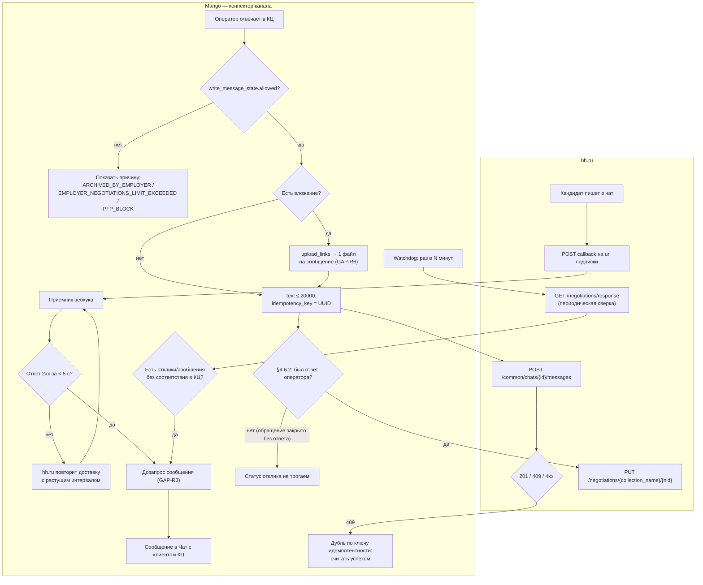

Отправка текста `^1` (пример значений — из спецификации):

```json
POST /common/chats/10267/messages
{
  "text": "Cъешь же ещё этих мягких французских булок, да выпей чаю",
  "idempotency_key": "8abcdef8-4abc-4edf-1234-1234567890ab",
  "is_automated": false
}
```

Отправка вложения `^1` — обратите внимание на `maxItems: 1`:

```json
POST /common/chats/10267/messages
{
  "file_upload_ids": ["1abcdef1-1234-4abc-4edf-1234567890ab"],
  "idempotency_key": "8abcdef8-4abc-4edf-1234-1234567890ab"
}
```

Условия загрузки файлов `^3` (пример спецификации целиком):

```json
{
  "files_upload": {
    "max_size": 20971520,
    "mime_type": ["image/jpeg", "image/png"],
    "type": ["jpeg", "png"]
  }
}
```

Состояние чата перед отправкой `^9`:

```json
{
  "chat_states": {
    "write_message_state": {"allowed": false, "reason": "ARCHIVED_BY_EMPLOYER"},
    "send_file_state": {"allowed": false}
  }
}
```

**Вывод СА:** подтверждает «БА» по всем трём утверждениям. Дополнительно модель
показывает, что контур сверки (`W1 → H8`) — не опция, а обязательный элемент
архитектуры: без него негарантированная доставка превращается в тихую потерю
обращений (риск R3).

### 7.3. Источники

| Сноска | Раздел документации | Метод / схема | Ссылка для проверки |
| --- | --- | --- | --- |
| `^1` | Чаты | `POST /common/chats/{chat_id}/messages` (`chat-message-post`), схемы `ChatsCommonMessagePostText` (`text`, `idempotency_key`, `is_automated`), `ChatsCommonMessagePostFileUploadIds` (`file_upload_ids`, `maxItems: 1`) | <https://api.hh.ru/openapi/redoc#tag/Chaty/operation/chat-message-post> |
| `^2` | Чаты | `POST /common/chats/files/upload_links` (`get-common-chat-files-upload-links`) | <https://api.hh.ru/openapi/redoc#tag/Chaty/operation/get-common-chat-files-upload-links> |
| `^3` | Чаты | `GET /common/chats/files/conditions` (`get-common-chat-files-conditions`), пример `ChatsCommonFilesConditions` | <https://api.hh.ru/openapi/redoc#tag/Chaty/operation/get-common-chat-files-conditions> |
| `^4` | Отклики/приглашения работодателя | `PUT /negotiations/{collection_name}/{nid}` (`change-negotiation-action`) | <https://api.hh.ru/openapi/redoc#tag/Otklikipriglasheniya-rabotodatelya/operation/change-negotiation-action> |
| `^5` | Отклики/приглашения работодателя | `PUT /negotiations/{id}` (`put-negotiations-collection-to-next-state`) | <https://api.hh.ru/openapi/redoc#tag/Otklikipriglasheniya-rabotodatelya/operation/put-negotiations-collection-to-next-state> |
| `^6` | Webhook API | Схема `WebhookActionChatMessageCreated` (описание условия доставки) | <https://api.hh.ru/openapi/redoc#tag/Webhook-API/operation/post-webhook-subscription> |
| `^7` | Webhook API | `POST /webhook/subscriptions` (`post-webhook-subscription`): описание метода (5 секунд, повторы, блокировка, «не являются средствами гарантированной доставки») и раздел `callbacks` (`security: null`) | <https://api.hh.ru/openapi/redoc#tag/Webhook-API/operation/post-webhook-subscription> |
| `^8` | Чаты | `GET /common/chats` (`get-common-chat-list`), параметры `page` (0…50), `per_page` (1…20) | <https://api.hh.ru/openapi/redoc#tag/Chaty/operation/get-common-chat-list> |
| `^9` | Чаты | `GET /common/chats/{chat_id}/messages` (`get-chat-messages`), схемы `ChatsCommonChatState`, `ChatsCommonMessage` (поле `type`) | <https://api.hh.ru/openapi/redoc#tag/Chaty/operation/get-chat-messages> |
| `^10` | Webhook API | Схема `WebhookPayloadChatMessageCreated` (поле `message_type`) | <https://api.hh.ru/openapi/redoc#tag/Webhook-API/operation/post-webhook-subscription> |
| `^11` | Отклики/приглашения работодателя | `GET /negotiations/response` (`get-collection-negotiations-list`), поля `actions[].url`, `actions[].arguments` | <https://api.hh.ru/openapi/redoc#tag/Otklikipriglasheniya-rabotodatelya/operation/get-collection-negotiations-list> |

## 8. ФТ-07 — Учёт нескольких Акторов в чате

### 8.1. БА

> **ФТ-07.** Система должна обеспечивать учет и консолидацию сообщений от
> нескольких Акторов в одном чате HeadHunter в рамках одного Обращения в КЦ,
> связанного с Кандидатом, при поступлении новых сообщений по паре
> «Кандидат — Вакансия».

| Подпункт | Цитата | Вердикт | Основание |
| --- | --- | --- | --- |
| §4.7.1 | «Консолидация сообщений выполняется по уникальной паре «Кандидат + Вакансия» в рамках одной Сессии.» | **Да** | Чат `NEGOTIATION` и есть единица «кандидат + вакансия» `^1`; `get-participant-list` `^2` возвращает участников с ролями `APPLICANT` / `EMPLOYER` / `BOT`, у соискателя — `resume_id`. Автора сообщения даёт `sender_display_info.role` `^3`. |
| §4.7.2 | «Сообщения, отправленные Рекрутером из КЦ, передаются в HeadHunter от имени авторизованного аккаунта интеграции (от лица компании).» | **Нет** | Каждое сообщение несёт `sender_display_info` с полями `name` («Имя отправителя сообщения»), `icon`, `role` `^3`; способа подменить отображаемое имя на название компании в спецификации нет. GAP-R2. |
| §4.7.3 | «Получение событий о новых сообщениях не зависит от статуса ответственного за Вакансию в HeadHunter Рекрутера.» | **Частично** | Прямо противоречит правилу доставки: событие приходит только менеджеру, который «является активным участником» чата `^4`. Выполнимо лишь при условии, что интеграционный менеджер — участник чата (митигации M1/M2, [раздел 12](#12-gap-r1--сквозное-ограничение-видимости-чатов)). |

**Проверка вывода L2 (раздел 6) — подтверждён полностью, без изменений.**
Формулировка «§4.7.2 не закрывается» и «§4.7.3 прямо противоречит документации
в исходной формулировке» перепроверена по свежей спецификации и остаётся
корректной.

> ⚠️ **GAP-R2** (уровень: Medium; подтверждён): отправка «от лица компании» не
> поддерживается — кандидат видит имя менеджера, под которым работает
> интеграция (`sender_display_info.name` `^3`). Обход — выделенный технический
> менеджер с нейтральным именем; это меняет отображаемое имя, но не природу
> ограничения. Дополнительно: `is_automated` («сообщение создано автоматически,
> например, с помощью AI») `^5` позволяет честно помечать автоответы КЦ, и ФТ
> должно определить, ставится ли этот признак.

**Вердикт ФТ-07: Частично.**

### 8.2. СА

Модель: диаграмма деятельности «многие ко многим» — как N Акторов одного чата
hh.ru сводятся в одно Обращение КЦ и что видит кандидат.

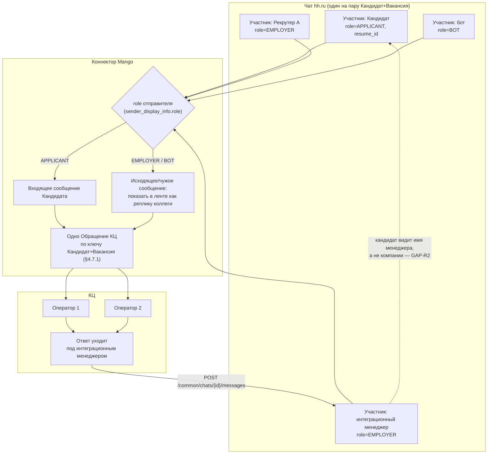

Участники чата `^2` (пример из спецификации):

```json
{
  "items": [
    {"id": "1", "name": "Работодатель", "role": "EMPLOYER", "type": "USER", "icon": null, "last_viewed_message_id": null},
    {"id": "2", "name": "Соискатель", "role": "APPLICANT", "type": "USER", "resume_id": "e72ceb06b77000000000000000000000", "icon": null, "last_viewed_message_id": null}
  ]
}
```

**Вывод СА:** модель подтверждает «БА» в обе стороны. Слева направо
консолидация работает без допущений (§4.7.1 — «Да»). Справа налево видно
ограничение §4.7.2: сколько бы операторов ни отвечало в КЦ, в hh.ru все реплики
приходят от одного участника `P3`, и его отображаемое имя — единственное, что
видит кандидат. Смена оператора кандидату не видна — это совпадает с намерением
ФТ, но имя компании подставить нельзя.

### 8.3. Источники

| Сноска | Раздел документации | Метод / схема | Ссылка для проверки |
| --- | --- | --- | --- |
| `^1` | Чаты | `GET /common/chats` (`get-common-chat-list`), поле `type` = `NEGOTIATION` | <https://api.hh.ru/openapi/redoc#tag/Chaty/operation/get-common-chat-list> |
| `^2` | Чаты | `GET /common/chats/{chat_id}/participants` (`get-participant-list`), схема `ChatsCommonParticipant` (`role`, `resume_id`, `last_viewed_message_id`) | <https://api.hh.ru/openapi/redoc#tag/Chaty/operation/get-participant-list> |
| `^3` | Чаты | `GET /common/chats/{chat_id}/messages` (`get-chat-messages`), схема `ChatsCommonSenderDisplayInfo` (`name`, `icon`, `role`) | <https://api.hh.ru/openapi/redoc#tag/Chaty/operation/get-chat-messages> |
| `^4` | Webhook API | Схемы `WebhookActionChatCreated` («является участником»), `WebhookActionChatMessageCreated` («является активным участником») | <https://api.hh.ru/openapi/redoc#tag/Webhook-API/operation/post-webhook-subscription> |
| `^5` | Чаты | `POST /common/chats/{chat_id}/messages` (`chat-message-post`), поле `is_automated` | <https://api.hh.ru/openapi/redoc#tag/Chaty/operation/chat-message-post> |

## 9. ФТ-08 — Передача контекста при создании обращения

### 9.1. БА

> **ФТ-08.** Система должна обеспечивать автоматическую передачу в Чат
> с клиентом КЦ контекстных данных о Кандидате и Вакансии в момент создания
> нового Обращения.

Подпункт §4.8.1 перечисляет состав контекста; ниже он разобран **по каждому
элементу списка**, потому что вердикты элементов различаются.

| Элемент §4.8.1 | Вердикт | Основание |
| --- | --- | --- |
| «текст сообщения (или всех сообщений… более чем от 1 Актора) по вакансии до взятия Обращения в работу» | **Да** | `GET /common/chats/{chat_id}/messages` с пагинацией: `start_message_id`, `limit` 1…50 (по умолчанию 10), `order` `prev`/`next`, признак `has_more` `^1`. Автор каждого сообщения — `sender_display_info.role` `^1`. |
| «название вакансии» | **Да** | `GET /vacancies/{vacancy_id}` `^2`; `vacancy_id` берётся из события отклика `^3` либо из соответствия `chat_id → vacancy_id` `^4`. |
| «ссылка на вакансию» | **Да** | Поле `alternate_url` вакансии, пример `https://hh.ru/vacancy/123456789` `^2`. |
| «ссылка на резюме» | **Да** | Поле `alternate_url` резюме, пример `https://hh.ru/resume/0123456789abcdef?t=…&vacancyId=…` `^5`. |
| «id кандидата в HeadHunter» | **Да** | `resume_id` участника с ролью `APPLICANT` `^6`, а также `resume_id` в payload события отклика `^3`. |
| «ФИО кандидата из резюме» | **Нет (не гарантировано)** | Просмотр резюме работодателем требует платного доступа; «если просмотр полных данных по резюме недоступен при текущей авторизации, в некоторых полях вернётся `null`, поле `can_view_full_info` будет иметь значение `false`, а поле `contact_view_status` — `NONE`» `^5`. |
| «телефон кандидата (при наличии)» | **Нет (не гарантировано)** | Там же: «при просмотре резюме с контактами действуют специальные правила» `^7`; `contact_view_status` может быть `NONE` `^5`. |
| §4.8.2 «Исторические данные… до момента подключения канала, не импортируются» | **Да** | Ограничение стороны Mango, API его не нарушает: точка отсечения задаётся датой подключения и `creation_time` сообщения `^1`. |

**Проверка вывода L2 (раздел 8) — подтверждён, формулировка усилена.**
L2 обосновывал GAP-R7 внешней документацией по просмотру резюме; в L4 то же
ограничение подтверждено **внутри самой спецификации** — описанием
`get-resume` `^5`, что делает проверку рецензентом однозначной (см. требование
issue #333 к подразделу 3).

> ⚠️ **GAP-R7** (уровень: Medium; подтверждён и уточнён): два из восьми
> элементов §4.8.1 — ФИО и телефон — не гарантированы API. Устойчивый ключ
> идентификации кандидата — `resume_id` `^6`, а не телефон. ФТ обязано описать
> поведение при `can_view_full_info: false` / `contact_view_status: NONE`:
> создавать ли Обращение с неполной карточкой, и что показывать оператору.

> ⚠️ **GAP-R9** (уровень: Low; подтверждён): тип `chat_id` в спецификации
> несогласован — в объекте отклика (`NegotiationsObjectsTopicItemCommon`) это
> `number` `^8`, в операциях раздела «Чаты» `^4` и в payload вебхуков `^3` —
> `string`. Интеграция обязана хранить идентификатор чата как строку.

**Вердикт ФТ-08: Частично** (совпадает с L2).

### 9.2. СА

Модель: диаграмма деятельности сборки карточки Обращения с явной ветвью
деградации при недоступных контактах.

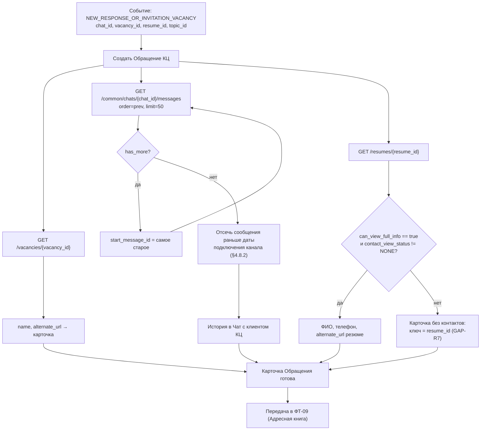

Признак недоступности контактов `^5`:

```json
{
  "can_view_full_info": false,
  "contact_view_status": "NONE",
  "alternate_url": "https://hh.ru/resume/0123456789abcdef?t=123456789&vacancyId=123456789"
}
```

Постраничное чтение истории `^1`:

```json
GET /common/chats/10267/messages?limit=50&order=prev&start_message_id=6403
{ "items": [ ... ], "has_more": true }
```

**Вывод СА:** подтверждает «БА». Модель показывает, что шесть из восьми
элементов контекста собираются по детерминированному пути, а два (ФИО,
телефон) находятся за условным переходом `C2`, который API может закрыть.
Ветвь `C4` — не исключение, а штатный режим, и он должен быть описан в ФТ.

### 9.3. Источники

| Сноска | Раздел документации | Метод / схема | Ссылка для проверки |
| --- | --- | --- | --- |
| `^1` | Чаты | `GET /common/chats/{chat_id}/messages` (`get-chat-messages`): `start_message_id`, `limit` (1…50), `order` (`prev`/`next`), `has_more`, `creation_time`, `sender_display_info` | <https://api.hh.ru/openapi/redoc#tag/Chaty/operation/get-chat-messages> |
| `^2` | Вакансии | `GET /vacancies/{vacancy_id}` (`get-vacancy`), поля `name`, `alternate_url` | <https://api.hh.ru/openapi/redoc#tag/Vakansii/operation/get-vacancy> |
| `^3` | Webhook API | Схема `WebhookPayloadNewResponseOrInvitationVacancy` (`chat_id`, `vacancy_id`, `resume_id`, `topic_id`, `employer_id`, `response_date`) | <https://api.hh.ru/openapi/redoc#tag/Webhook-API/operation/post-webhook-subscription> |
| `^4` | Чаты | `GET /common/chats` (`get-common-chat-list`), связка `id` (string) ↔ `vacancy_id` | <https://api.hh.ru/openapi/redoc#tag/Chaty/operation/get-common-chat-list> |
| `^5` | Просмотр резюме | `GET /resumes/{resume_id}` (`get-resume`): описание метода (платный доступ, `can_view_full_info`, `contact_view_status`), поле `alternate_url` | <https://api.hh.ru/openapi/redoc#tag/Prosmotr-rezyume/operation/get-resume> |
| `^6` | Чаты | `GET /common/chats/{chat_id}/participants` (`get-participant-list`), поле `resume_id` у роли `APPLICANT` | <https://api.hh.ru/openapi/redoc#tag/Chaty/operation/get-participant-list> |
| `^7` | Просмотр резюме | Раздел «Просмотр резюме с контактами» (ссылка из описания `get-resume`) | <https://api.hh.ru/openapi/redoc#tag/Prosmotr-rezyume/Prosmotr-rezyume-s-kontaktami> |
| `^8` | Отклики/приглашения работодателя | `GET /negotiations/response` (`get-collection-negotiations-list`), схема `NegotiationsObjectsTopicItemCommon` (`chat_id` как `number`) | <https://api.hh.ru/openapi/redoc#tag/Otklikipriglasheniya-rabotodatelya/operation/get-collection-negotiations-list> |

## 10. ФТ-09 — Автосопоставление кандидата с Адресной книгой

### 10.1. БА

> **ФТ-09.** Система должна обеспечивать автоматическое сопоставление,
> сохранение и актуализацию данных Кандидата в Адресной книге (АК) КЦ в момент
> создания нового Обращения.

| Подпункт | Цитата | Вердикт | Основание |
| --- | --- | --- | --- |
| §4.9.1 | «При отсутствии совпадений создается новая карточка контакта.» | **Да** | Логика целиком на стороне Mango; со стороны hh.ru всегда доступен хотя бы один ключ — `resume_id` `^1`. |
| §4.9.2 | «При частичном совпадении данных выполняется дополнение карточки.» | **Частично** | «Частичное совпадение» не определено: набор ключей переменный, телефон и ФИО могут отсутствовать (GAP-R7, `contact_view_status: NONE` `^2`). Без приоритета ключей правило неисполнимо однозначно. |
| §4.9.3 | «При полном совпадении всех ключей обновление карточки не выполняется.» | **Частично** | «Все ключи» не перечислены. Если в набор входит телефон, условие «полное совпадение» для анонимного резюме недостижимо в принципе `^2`. |

**Проверка вывода L2 (раздел 9) — подтверждён; добавлена привязка к подпунктам.**
L2 фиксировал общий вывод «правило сопоставления требует доопределения» без
разбора §4.9.1–§4.9.3. В L4 разбор выполнен, и он показывает, что проблема
локализована в §4.9.2 и §4.9.3, тогда как §4.9.1 закрывается.

> ⚠️ **GAP-R12** (уровень: Medium; по существу зафиксирован в L2 без номера, в L4 формализован): в ФТ не задан
> приоритет ключей сопоставления. Обоснованный порядок:
> **1) `resume_id`** — приходит всегда, и в участниках чата `^1`, и в событии
> отклика `^3`; **2) телефон**; **3) e-mail** — оба зависят от прав просмотра
> контактов `^2`. Порядок должен попасть в ФТ, иначе §4.9.2 и §4.9.3
> реализуются по усмотрению разработчика.

**Вердикт ФТ-09: Частично** (совпадает с L2).

### 10.2. СА

Модель: диаграмма деятельности правила сопоставления с явным порядком ключей —
именно того, чего не хватает в ФТ.

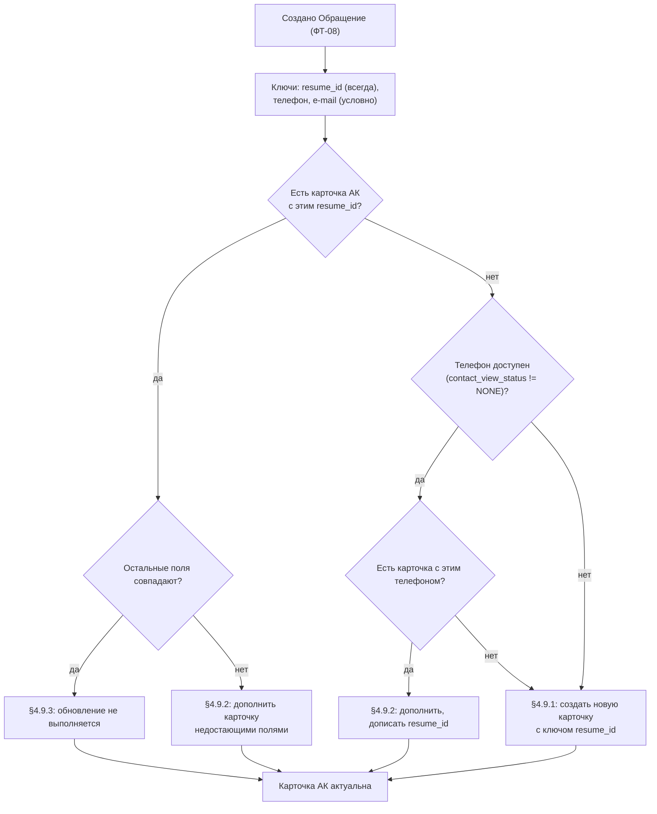

**Вывод СА:** подтверждает «БА». Модель разрешима **только** потому, что в неё
внесён порядок ключей, отсутствующий в ФТ: если начать не с `resume_id`,
а с телефона, ветвь `L1 -- нет` уводит все анонимные резюме в §4.9.1 и
порождает дубли карточек при каждом новом отклике того же кандидата. Это
конкретное последствие GAP-R12 и аргумент для его закрытия.

### 10.3. Источники

| Сноска | Раздел документации | Метод / схема | Ссылка для проверки |
| --- | --- | --- | --- |
| `^1` | Чаты | `GET /common/chats/{chat_id}/participants` (`get-participant-list`), поле `resume_id`, роль `APPLICANT` | <https://api.hh.ru/openapi/redoc#tag/Chaty/operation/get-participant-list> |
| `^2` | Просмотр резюме | `GET /resumes/{resume_id}` (`get-resume`): `can_view_full_info`, `contact_view_status` | <https://api.hh.ru/openapi/redoc#tag/Prosmotr-rezyume/operation/get-resume> |
| `^3` | Webhook API | Схема `WebhookPayloadNewResponseOrInvitationVacancy`, поле `resume_id` | <https://api.hh.ru/openapi/redoc#tag/Webhook-API/operation/post-webhook-subscription> |

## 11. ФТ-10 — Отчётность и выгрузка

### 11.1. БА

> **ФТ-10.** Система должна предоставлять возможность Пользователю
> формирования и выгрузки отчетов по взаимодействиям с Кандидатами в Чате
> с клиентом КЦ в интерфейсе КЦ по результатам обработанных Обращений.

| Подпункт | Цитата | Вердикт | Основание |
| --- | --- | --- | --- |
| §4.10.1 | «Канал HeadHunter добавляется в следующие отчеты и фильтры отчетов "КЦ → Обращения": История обращений; Контроль сотрудников → Текст.» | **Да** | Сторона Mango: отчёт «История обращений» уже имеет фильтр по каналу, добавление канала — типовая доработка. Ограничений со стороны hh.ru API нет. |
| §4.10.2 | «В отчеты передаются только сопоставимые с API МД поля из API HeadHunter.» | **Да** | Состав полей известен точно: у чата — `id`, `type`, `creation_time`, `unread_message_count`, `vacancy_id`, `last_message` `^1`; у сообщения — `id`, `creation_time`, `type`, `sender_participant_id`, `sender_display_info.role`, `payload.text`, `payload.attachments`, `viewed_by_opponent` («факт просмотра сообщения оппонентом») `^2`. |
| §4.10.3 | «Формирование статистики и выгрузка отчетов реализуются через штатный интерфейс экспорта КЦ.» | **Да** | Сторона Mango, вне периметра hh.ru API. |

**Проверка вывода L2 (раздел 10) — подтверждён; вердикт «Да» сохраняется.**
Ограничение RUN-0056 («состав выгружаемых полей зависит от снятия GAP-1») снято
и в L4: перечень полей выше приведён с точными именами по свежей спецификации
(в частности, текст сообщения — `payload.text`, а не `text`; см.
[раздел 15](#15-что-исправлено-относительно-l2-run-0058)).

Замечание, не меняющее вердикт: §4.10.2 говорит «только сопоставимые поля», но
перечня сопоставимых полей в ФТ нет. Для отчётности это допустимо (сопоставление
делается на стороне МД), однако в проектной спецификации таблицу соответствия
придётся составить явно — иначе `viewed_by_opponent` и `unread_message_count`,
не имеющие прямого аналога в МД, будут потеряны молча.

**Вердикт ФТ-10: Да** (совпадает с L2).

### 11.2. СА

Модель: диаграмма деятельности потока данных «чат hh.ru → хранилище КЦ →
отчёт», проверяющая утверждение «состав полей достаточен и известен».

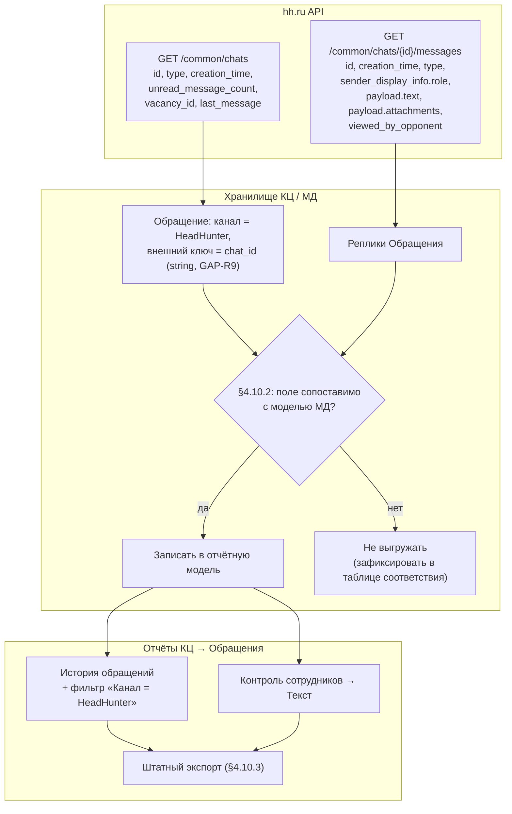

**Вывод СА:** подтверждает «БА» и вердикт «Да». Единственный узел, требующий
решения, — `D3`; он находится целиком на стороне Mango и не создаёт разрыва
с hh.ru API. Модель также показывает, что ключом связывания отчётной записи
с hh.ru служит `chat_id`, к которому применимо GAP-R9 (хранить строкой).

### 11.3. Источники

| Сноска | Раздел документации | Метод / схема | Ссылка для проверки |
| --- | --- | --- | --- |
| `^1` | Чаты | `GET /common/chats` (`get-common-chat-list`), схемы `ChatsCommonChatBasic` / `ChatsCommonChatItems` | <https://api.hh.ru/openapi/redoc#tag/Chaty/operation/get-common-chat-list> |
| `^2` | Чаты | `GET /common/chats/{chat_id}/messages` (`get-chat-messages`), схема `ChatsCommonMessage` (`payload.text`, `payload.attachments`, `viewed_by_opponent`, `type`) | <https://api.hh.ru/openapi/redoc#tag/Chaty/operation/get-chat-messages> |

## 12. GAP-R1 — сквозное ограничение видимости чатов

Раздел сквозной: GAP-R1 затрагивает ФТ-05, ФТ-06 и ФТ-07 одновременно, поэтому
вынесен отдельно и оформлен по той же схеме «БА → СА → Источники».

### 12.1. БА

**Формулировка Заказчика (⚠️ caveat постановки).** Чат создаётся автоматически
только для менеджера, ответственного за вакансию; только он видит чат в своём
списке. Если в чат пишет другой пользователь, он добавляется в участники.

**Проверка по спецификации — подтверждается полностью (вывод L2 раздел 7
оставлен без изменений).**

- `WebhookActionChatCreated`: «Создание чата. Событие присылается менеджеру
  работодателя по тем чатам, в которых он **является участником**» `^1`;
- `WebhookActionChatMessageCreated`: «…в которых он **является активным
  участником**» `^1`;
- `get-participant-list` `^2`, `put-participant-list` `^3`, `get-chat-messages`
  `^4`: ответ `404` — «Чат не найден или не доступен текущему пользователю»;
- существует явная операция добавления участника
  `PUT /common/chats/{chat_id}/participants`, тело
  `{"id": "<идентификатор добавляемого в чат менеджера>"}`, ответ `204` `^3`;
- сообщения типов `PARTICIPANT_JOINED` и `PARTICIPANT_LEFT` фиксируют изменения
  состава участников в ленте чата `^4` — добавление участника **видимо**
  в переписке;
- в спецификации есть отдельные теги «…на уровне работодателя» для откликов,
  резюме, вакансий, менеджеров, адресов и комментариев. **Для чатов такого тега
  нет** — проверяется по списку разделов
  [индекса источников](./hh-api-source-index.md).

> ⚠️ **GAP-R1 — HIGH RISK** (подтверждён): чат по отклику доступен только
> менеджерам-участникам, по умолчанию — одному ответственному за вакансию;
> события `CHAT_CREATED` и `CHAT_MESSAGE_CREATED` доставляются только
> участникам `^1`; доступа к чатам «на уровне работодателя» в API нет. Без
> специального решения канал КЦ получит переписку только по вакансиям того
> менеджера, под которым подключена интеграция, и цель ФТ §2.2 не будет
> достигнута.

Митигации (перенесены из L2 раздела 7.1 и сверены с рекомендацией RUN-0059
раздела 7.2 — расхождений нет):

| # | Митигация | Как работает | Статус подтверждения | Цена |
| --- | --- | --- | --- | --- |
| M1 | Интеграционный менеджер назначается **ответственным** за все вакансии из перечня канала | Чаты создаются сразу у него; обходы не нужны | **Подтверждено документацией** (следует из правила создания чата) | Организационное изменение: ответственный в hh.ru перестаёт быть «живым» рекрутером |
| M2 | Подписка `NEW_RESPONSE_OR_INVITATION_VACANCY` с `vacancies_only_mine: false` `^1` + автодобавление интеграционного менеджера через `put-participant-list` `^3` | Событие приходит по всем вакансиям, к которым есть доступ, и несёт `chat_id`; интеграция сразу становится участником | **Не подтверждено**: спецификация не определяет, доступен ли чужой чат для `put-participant-list` (возможен `403`/`404` `^3`). Гипотеза **Г1** | Системное сообщение `PARTICIPANT_JOINED`, видимое кандидату `^4` |
| M3 | Первое исходящее отправляет ответственный менеджер | Соответствует правилу «кто пишет — тот участник» | **Не подтверждено** для обратного направления: чтобы написать, нужен доступ к чату `^5` | Ручное действие на каждый новый чат — неприемлемо при массовом подборе |
| M4 | Запрос к hh.ru на доступ к чатам на уровне работодателя | Снимает ограничение полностью | Организационно, срок не контролируется | Внешняя зависимость |

Рекомендация: **M1 как основа договорённости с Заказчиком, M2 как целевая
автоматизация после подтверждения Г1.** Строить решение только на M2 до
проверки нельзя.

### 12.2. Единая точка отказа

Интеграция целиком живёт под одним менеджерским аккаунтом
(`X-Manager-Account-Id` `^6`). Блокировка или удаление менеджера обрывает
канал, а при отзыве пользователем доступа приложению «все подписки удаляются»
`^7` — канал умолкает **тихо**, без ошибки на стороне КЦ. Требуются: мониторинг
доставки событий, алерт на постановку подписки в очередь на блокировку `^7`
и процедура смены интеграционного менеджера с пересозданием подписок и
повторным включением в чаты. В ФТ такой процедуры нет.

### 12.3. Влияние GAP-R1 на сценарии КЦ

| Сценарий КЦ | Что требуется на стороне hh.ru | Влияние GAP-R1 | Блокирует? |
| --- | --- | --- | --- |
| Групповая обработка обращений группой рекрутеров | Полный входящий поток по фильтруемым вакансиям в один интеграционный аккаунт | Прямое: без M1/M2 поток ограничен вакансиями одного менеджера | Не блокирует **архитектурно**, блокирует **бизнес-цель**, если ни одна митигация не применена |
| Передача чата между операторами | Ничего: в hh.ru участник один и тот же | Нет; смена оператора кандидату не видна | Нет |
| Skill-based маршрутизация, резервный сотрудник, автозавершение | Ничего: маршрутизация выполняется в КЦ | Нет | Нет |
| Ответ оператора кандидату | Право писать = участие в чате + `write_message_state.allowed` `^4` | Косвенное: пишет тот же интеграционный участник | Нет |
| Отчётность по каналу | Данные уже в КЦ | Полнота отчётов наследует полноту входящего потока | Нет |

**Ответ на вопрос постановки** («блокирующий фактор или архитектурный обходной
путь?»): **архитектурный обходной путь**. Ограничение не запрещает ни один
сценарий КЦ, но задаёт обязательное условие развёртывания — интеграционный
менеджер должен быть участником каждого обрабатываемого чата. Риск оценивается
как **High** именно потому, что без обоих решений интеграция выглядит
работающей — сообщения приходят, обращения создаются, — но покрывает лишь часть
потока, и дефект обнаруживается уже в эксплуатации (риск R1).

### 12.4. СА

Модель: диаграмма деятельности с ветвлением по состоянию «участник / не
участник» — она показывает, что **обе ветви внешне успешны**, и именно поэтому
GAP-R1 не обнаруживается тестом «сообщение дошло».

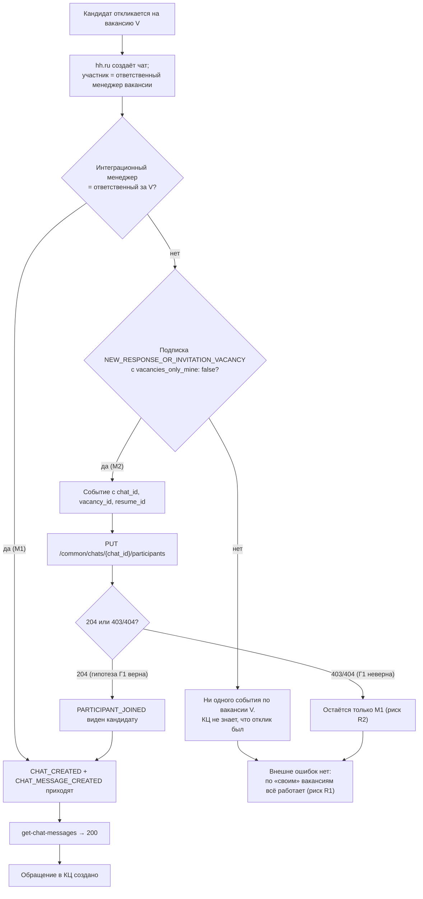

Добавление участника `^3`:

```json
PUT /common/chats/10267/participants
{ "id": "11111111" }
→ 204 No Content   // либо 404 «Чат не найден или не доступен текущему пользователю»
```

**Вывод СА:** подтверждает «БА» и уточняет его. Узел `X2` — главный результат
модели: отсутствие потока по чужим вакансиям **неотличимо от отсутствия
откликов**, потому что ошибки не возникает нигде. Отсюда следует требование,
которого нет в ФТ: сверка числа откликов по вакансиям канала
(`get-collection-negotiations-list` `^8`) с числом созданных Обращений — это
единственный способ обнаружить GAP-R1 в эксплуатации.

### 12.5. Источники

| Сноска | Раздел документации | Метод / схема | Ссылка для проверки |
| --- | --- | --- | --- |
| `^1` | Webhook API | `POST /webhook/subscriptions` (`post-webhook-subscription`), схемы `WebhookActionChatCreated`, `WebhookActionChatMessageCreated`, `WebhookActionVacancyOnlyMineSettings.vacancies_only_mine` | <https://api.hh.ru/openapi/redoc#tag/Webhook-API/operation/post-webhook-subscription> |
| `^2` | Чаты | `GET /common/chats/{chat_id}/participants` (`get-participant-list`), ответ `404` | <https://api.hh.ru/openapi/redoc#tag/Chaty/operation/get-participant-list> |
| `^3` | Чаты | `PUT /common/chats/{chat_id}/participants` (`put-participant-list`), тело `{"id": …}`, ответы `204` / `404` | <https://api.hh.ru/openapi/redoc#tag/Chaty/operation/put-participant-list> |
| `^4` | Чаты | `GET /common/chats/{chat_id}/messages` (`get-chat-messages`): `404`, типы `PARTICIPANT_JOINED` / `PARTICIPANT_LEFT`, `write_message_state` | <https://api.hh.ru/openapi/redoc#tag/Chaty/operation/get-chat-messages> |
| `^5` | Чаты | `POST /common/chats/{chat_id}/messages` (`chat-message-post`) | <https://api.hh.ru/openapi/redoc#tag/Chaty/operation/chat-message-post> |
| `^6` | Менеджеры работодателя | `GET /manager_accounts/mine` (`get-manager-accounts`), заголовок `X-Manager-Account-Id` | <https://api.hh.ru/openapi/redoc#tag/Menedzhery-rabotodatelya/operation/get-manager-accounts> |
| `^7` | Webhook API | `POST /webhook/subscriptions` (`post-webhook-subscription`), описание: удаление подписок при отзыве доступа, очередь на блокировку | <https://api.hh.ru/openapi/redoc#tag/Webhook-API/operation/post-webhook-subscription> |
| `^8` | Отклики/приглашения работодателя | `GET /negotiations/response` (`get-collection-negotiations-list`) | <https://api.hh.ru/openapi/redoc#tag/Otklikipriglasheniya-rabotodatelya/operation/get-collection-negotiations-list> |

## 13. Пути получения сообщений и выбор для КЦ

Раздел сохранён из L2 (раздел 11) без изменения выводов и дополнен колонкой
проверки по свежей спецификации.

| | Путь 1: отклик → `chat_id` | Путь 2: `get-common-chat-list` | Путь 3: вебхук `CHAT_MESSAGE_CREATED` | Путь 4: вебхук отклика + добавление участника |
| --- | --- | --- | --- | --- |
| Как работает | `get-collection-negotiations-list` по вакансии → `chat_id` → `get-chat-messages` | `GET /common/chats` → `chat_id` → `get-chat-messages` | Подписка → `chat_id`, `message_id` → `get-chat-messages` | `NEW_RESPONSE_OR_INVITATION_VACANCY` (`vacancies_only_mine: false`) → `chat_id`, `vacancy_id`, `resume_id` → `put-participant-list` → далее Путь 3 |
| Задержка | Период опроса (минуты) | Период опроса (минуты) | Секунды | Секунды после включения в чат |
| Даёт `vacancy_id` | Да | Да (поле `vacancy_id`) | **Нет** (GAP-R3) | **Да** |
| Ограничение масштабирования | Пагинация по каждой вакансии | `page` ≤ 50, `per_page` ≤ 20 → ≈1000 чатов; нет сортировки и фильтра «изменённые с» | Один URL на пользователя; доставка не гарантирована | То же, что Путь 3 |
| Зависимость от GAP-R1 | Отклики видны на уровне работодателя, но `get-chat-messages` — только участнику | Список содержит только чаты текущего менеджера | Только чаты, где менеджер активный участник | **Смягчает GAP-R1** |
| Роль в целевой схеме | Сверка пропусков, догрузка истории | Первичная инвентаризация, диагностика | **Основной поток реального времени** | **Входная точка нового чата** |
| Проверка в L4 | Подтверждено ([раздел 12](#12-gap-r1--сквозное-ограничение-видимости-чатов)) | Подтверждено ([раздел 7](#7-фт-06--двусторонняя-синхронизация-в-реальном-времени)) | Подтверждено ([раздел 5](#5-фт-04--фильтрация-по-признаку-вакансии)) | Подтверждено ([раздел 3](#3-фт-02--подключение-канала)) |

**Выбор для архитектуры КЦ Mango: комбинация Путей 4 + 3 с Путём 1 в роли
сверки** — вывод L2 сохраняется. Обоснование (ФТ-06 требует реального времени;
событие сообщения не несёт вакансию; §4.7.3 требует независимости от
ответственного рекрутера; доставка вебхуков не гарантирована; Путь 2 не
поддерживает инкрементальное чтение) перепроверено по свежей спецификации
и остаётся в силе.

## 14. Сводка разрывов

| # | Разрыв | Уровень | Затронутые ФТ | Статус в L4 |
| --- | --- | --- | --- | --- |
| GAP-R1 | Чат виден только менеджерам-участникам; доступа на уровне работодателя нет | **High** | ФТ-05, ФТ-06, ФТ-07 | Подтверждён |
| GAP-R2 | Отправка «от лица компании» не поддерживается | Medium | ФТ-07 | Подтверждён |
| GAP-R3 | В событии `CHAT_MESSAGE_CREATED` нет вакансии, резюме и текста | Medium | ФТ-04, ФТ-05, ФТ-06 | Подтверждён |
| GAP-R4 | Доставка вебхуков не гарантирована; список чатов без сортировки и «изменённые с», потолок ≈1000 | Medium | ФТ-06 | Подтверждён |
| GAP-R5 | Нет классификатора «линейный персонал»; фильтр по вакансиям ≤100 id | Medium | ФТ-04 | Подтверждён |
| GAP-R6 | Вложения: один файл на сообщение, в примере условий только JPEG/PNG до 20 МиБ | Medium | ФТ-06 | Подтверждён |
| GAP-R7 | Скрытые контакты, платный доступ, `contact_view_status: NONE` | Medium | ФТ-08, ФТ-09 | Подтверждён и **усилен**: обоснован внутри спецификации (`get-resume`) |
| GAP-R8 | Смена статуса отклика — отдельное действие | Low | ФТ-06 | Подтверждён |
| GAP-R9 | Несогласованный тип `chat_id`: `number` в откликах, `string` в чатах и вебхуках | Low | ФТ-05, ФТ-06, ФТ-08, ФТ-10 | Подтверждён, расширен список ФТ |
| GAP-R10 | Лимиты и квоты методов чатов не документированы | Low | ФТ-06, НФТ | Подтверждён |
| **GAP-R11** | `filter_has_text_message` — «фильтр по чатам с активными переписками», а не «есть текстовое сообщение»; тип `SIMPLE` покрывает и сообщения без текста | **Medium** | ФТ-05 | **Новый в L4**; понижает ФТ-05 с «Да» до «Частично» |
| **GAP-R12** | Не задан приоритет ключей сопоставления с Адресной книгой | Medium | ФТ-09 | **Формализован в L4** (в L2 присутствовал без номера) |

## 15. Что исправлено относительно L2 (RUN-0058)

Проверка выполнена по требованию постановки: «Если сформулировано корректно,
оставить, если ошибки — скорректировать». Ниже — **только расхождения**; всё
остальное содержание L2 подтверждено дословно и перенесено в L4 со сносками.

| # | Где в L2 | Что было | Как правильно | Последствие |
| --- | --- | --- | --- | --- |
| 1 | Раздел 4 (ФТ-05) | `filter_has_text_message` описан как «только чаты, в которых есть хотя бы одно текстовое сообщение» | В спецификации: «Фильтр по чатам с активными переписками. Доступно только для работодателя»; при этом тип `SIMPLE` — «сообщение с текстом **либо вложениями**» | **Вердикт ФТ-05 понижен: Да → Частично**; введён GAP-R11; «текстовость» требует проверки `payload.text != null` после дозапроса |
| 2 | Раздел 3 (ФТ-04) | `vacancy_id` и `last_message` отнесены к схеме `ChatsCommonChatBasic` | Оба поля приходят из inline-ветви `allOf` схемы `ChatsCommonChatItems`; `vacancy_id` также есть в `ChatsCommonMessagesResponse` | Вывод не меняется; исправлено имя схемы, по которому рецензент проверяет факт |
| 3 | Разделы 4–5 | Поле типа сообщения называется то `type`, то `message_type` | Это **разные поля разных схем**: `ChatsCommonMessage.type` и `WebhookPayloadChatMessageCreated.message_type` | Значения совпадают, имена — нет; при маппинге смешивать нельзя |
| 4 | Раздел 5.2 (ФТ-06) | Пример условий загрузки назван `ChatsCommonFilesConditionsResponse` | Пример называется `ChatsCommonFilesConditions` | Вывод GAP-R6 не меняется, исправлена ссылка для проверки |
| 5 | Раздел 8 (ФТ-08) | GAP-R7 обоснован внешней документацией по просмотру резюме | Ограничение описано **в самой спецификации**, в описании `get-resume` (`can_view_full_info`, `contact_view_status: NONE`, платный доступ) | Разрыв стал проверяемым по ссылке, как требует постановка |
| 6 | Метаданные | SHA-256 спецификации `4349900b…6383d` | На 2026-08-27: `8ea1380bf87d7351cf2f977f9918bbdd03a26a6b9c9e95eb50f3d4ae080a7576`, 1 266 778 байт, 131 операция в 47 разделах | Спецификация изменилась между RUN-0058 и RUN-0060; все выводы перепроверены заново |

Дополнительно проверен **RUN-0059** (маппинг данных, раздел 4.3). Имена полей
hh.ru в матрице маппинга не совпадают со спецификацией:

| В RUN-0059 | В спецификации |
| --- | --- |
| `items[].text` | `items[].payload.text` |
| `items[].created_at` | `items[].creation_time` |
| `items[].participant.role` | `items[].sender_display_info.role` (плюс `items[].sender_participant_id`) |
| — | `items[].payload.attachments[]`, `items[].payload.moved_participant` не учтены |

Логика маппинга и выводы RUN-0059 (варианты A/B/C, рекомендация варианта A)
при этом верны и не меняются — исправление касается имён полей, которые пойдут
в проектную спецификацию.

## 16. Риски

| # | Риск | Основание | Влияние | Изменение к L2 |
| --- | --- | --- | --- | --- |
| R1 | Интеграция покрывает не весь поток обращений из-за GAP-R1 и это обнаруживается в эксплуатации | Схемы `WebhookAction*`; отсутствие уровня работодателя для чатов; узел `X2` модели [12.4](#124-са) | Критическое: цель ФТ §2.2 не достигается | Без изменений; добавлен контроль — сверка числа откликов с числом Обращений |
| R2 | Гипотеза Г1 (добавление себя в чужой чат) не подтвердится | `404` «Чат не найден или не доступен текущему пользователю» | Высокое: остаётся только организационная митигация M1 | Без изменений |
| R3 | Потери сообщений при сбоях приёмника вебхуков | «Вебхуки не являются средствами гарантированной доставки»; таймаут 5 с | Высокое без механизма сверки | Без изменений; контур сверки признан обязательным элементом архитектуры |
| R4 | Подделка колбэка: подпись не документирована | `security: null` у колбэка | Среднее: нужен секрет в URL и перепроверка запросом к API | Без изменений |
| R5 | Неизвестные лимиты методов чатов приводят к троттлингу | GAP-R10 | Среднее: НФТ не сформулировать без данных hh.ru | Без изменений |
| R6 | Единый интеграционный менеджер как точка отказа; отзыв доступа удаляет подписки | Раздел Webhook API; `X-Manager-Account-Id` | Среднее | Уточнено: канал умолкает **тихо** ([12.2](#122-единая-точка-отказа)) |
| R7 | Требуется платный доступ работодателя к части методов | Описание `get-resume`: «Требуется наличие платного доступа» | Высокое для продажи | Усилено: подтверждено внутри спецификации |
| **R8** | Отбор чатов по `filter_has_text_message` даёт не тот набор, что подразумевает §4.5.1, и часть обращений создаётся по сообщениям без текста | GAP-R11 | Среднее: ложные Обращения либо пропуски | **Новый в L4** |

## 17. Вопросы Заказчику

Вопросы 1–8 сохранены из L2 (раздел 15) без изменений — ни один из них не снят
проверкой спецификации. Добавлены два новых, вытекающих из GAP-R11 и GAP-R12.

1. Готов ли Заказчик назначить интеграционного менеджера ответственным за
   вакансии из перечня канала (митигация M1), или требуется дождаться
   подтверждения автоматического добавления участника (M2)?
2. Допустимо ли, что в переписке появится системная запись `PARTICIPANT_JOINED`
   при подключении интеграции к чату — то есть кандидат увидит факт
   подключения?
3. Чем заменить категорию «линейный персонал» в ФТ-04: явным перечнем вакансий
   (не более 100 идентификаторов на запрос) или иным признаком на стороне
   Заказчика?
4. Какое действие над откликом должна выполнять интеграция после ответа
   оператора (§4.6.2) и от чьего имени — набор доступных статусов зависит от
   вакансии?
5. Допустимо ли, что кандидат видит имя технического менеджера вместо названия
   компании (§4.7.2), и нужно ли помечать автоответы канала признаком
   `is_automated`?
6. Какие типы вложений реально нужны в канале: документированные условия
   загрузки в примере ограничены изображениями, и передача резюме или PDF
   из КЦ может оказаться недоступной?
7. Каковы НФТ (§5 пуст): ожидаемый объём сообщений в сутки, допустимая задержка
   доставки, требования к доступности приёмника вебхуков?
8. Подтверждён ли платный/партнёрский доступ работодателя к API hh.ru
   у целевого клиента?
9. **(новый, GAP-R11)** Должно ли Обращение создаваться по сообщению, которое
   содержит только вложение и не содержит текста? От ответа зависит правило
   §4.5.1 и объём дозапросов.
10. **(новый, GAP-R12)** Каков приоритет ключей сопоставления с Адресной
    книгой и какие ключи входят в «полное совпадение» §4.9.3? Предлагается
    `resume_id` → телефон → e-mail; телефон и e-mail могут отсутствовать.

---

## Как проверять этот отчёт

1. Каждая сноска `^N` в подразделе «БА» раскрывается в таблице «Источники» того
   же раздела ФТ и ведёт на конкретную операцию в документации hh.ru.
2. Ссылки построены по схеме
   `https://api.hh.ru/openapi/redoc#tag/<slug(раздел)>/operation/<operationId>`
   и открывают нужный метод сразу, без поиска по странице.
3. Полный перечень операций с готовыми ссылками —
   [`hh-api-source-index.md`](./hh-api-source-index.md); он воспроизводится
   командой из самого файла.
4. Версия источника зафиксирована контрольной суммой в шапке отчёта: если
   SHA-256 спецификации отличается от указанной, выводы требуют перепроверки.
